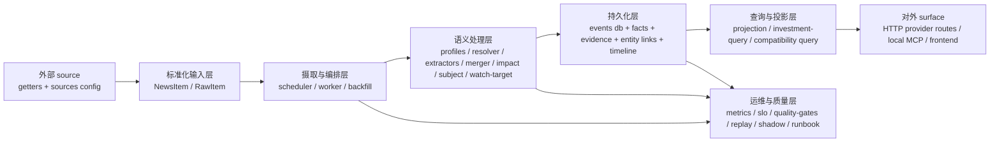

# 投资事件系统架构

状态：使用中
最后更新：2026-05-02
范围：`newsnow` 事件系统当前代码实现的抽象层级、模块边界与现状
文档角色：当前生效的总体架构设计与约束
更新时机：系统分层、关键模块边界、核心存储结构或对外语义边界发生变化时

## 1. 目标

这份文档只描述**当前系统真实存在的架构**。

它不是理想蓝图，也不是产品愿景；它要回答的是：

- 当前系统有哪些层
- 每一层在代码里落在哪
- 哪些能力已经存在
- 哪些能力还只是部分能力，而不是完整层

## 2. 当前系统的总体边界

`newsnow` 当前的事件系统是一套 backend-owned canonical event engine。

它负责：

- source collection 与标准化
- event classification、fact extraction、merge、timeline
- evidence、entity linkage、investment semantics
- provider-facing investment projection

frontend、watchlist、MCP 和 agent-facing surface 都只消费这套 backend truth。

## 3. 当前抽象层级

## 4. 各层现状

### 4.1 标准化输入层

当前代码：

- [`/Users/huangjiahao/workspace/industry-investment-suite/repos/newsnow/shared/types.ts`](/Users/huangjiahao/workspace/industry-investment-suite/repos/newsnow/shared/types.ts)
- [`/Users/huangjiahao/workspace/industry-investment-suite/repos/newsnow/shared/sources.ts`](/Users/huangjiahao/workspace/industry-investment-suite/repos/newsnow/shared/sources.ts)
- `getters/*` 与各 source adapter

职责：

- 从外部 source 获取原始内容
- 统一归一到 `NewsItem`
- 提供 source metadata、event profile 与 column 归属

当前现状：

- 输入标准化已经存在，但 `NewsItem` 仍然带有展示历史包袱
- 更完整的语义收敛发生在后续 ingest 和 semantic pipeline 中

### 4.2 摄取与编排层

当前代码：

- [`/Users/huangjiahao/workspace/industry-investment-suite/repos/newsnow/server/services/event-engine/scheduler.ts`](/Users/huangjiahao/workspace/industry-investment-suite/repos/newsnow/server/services/event-engine/scheduler.ts)
- [`/Users/huangjiahao/workspace/industry-investment-suite/repos/newsnow/server/services/event-bus.ts`](/Users/huangjiahao/workspace/industry-investment-suite/repos/newsnow/server/services/event-bus.ts)

职责：

- worker 启动、refresh、backfill、source 范围控制
- 将标准化输入推进到 canonical event pipeline
- 维护摄取节奏和 source 级别编排

当前现状：

- `event-bus.ts` 已退化成兼容 facade，真实编排逻辑在 `scheduler.ts`
- ingest path 已接入 live subject role extractor 和 live watch-target extractor

### 4.3 语义处理层

当前代码：

- `profiles.ts`
- `resolver.ts`
- `extractors/*`
- `merger.ts`
- `impact.ts`
- `subject-resolution.ts`
- `watch-target-candidates.ts`

职责：

- source kind / event type / subtype 分类
- minimal facts 提取
- event identity / cluster key / periodic series 收敛
- impact snapshot 计算
- subject arbitration
- watch target candidate 推理与 registry grounding

当前现状：

- 第一层“发生了什么事”的主干已经闭环
- 第二层 relation graph / causal hypothesis 还没有形成正式 persisted layer
- 第三层 impact 目前已有 `directionalView`、`materialityScore`、`affectedMarkets`、`impactSummary`，但还不是完整的 `ImpactPathway / ImpactAssessment` 层
- 第四层已有 `watchTargetCandidates` v1，但它仍是局部能力，不是完整投资映射层

### 4.4 LLM assistive layer

当前代码：

- [`/Users/huangjiahao/workspace/industry-investment-suite/repos/newsnow/server/services/llm/runtime.ts`](/Users/huangjiahao/workspace/industry-investment-suite/repos/newsnow/server/services/llm/runtime.ts)
- `subject-role-live-extractor.ts`
- `watch-target-live-extractor.ts`
- `prompts/*`
- `prompt-registry.ts`

职责：

- 提供受控的 structured-output LLM runtime
- 目前支持 `openai` / `minimax`
- 当前主要服务两个 bounded 场景：
  - subject role extraction
  - watch target candidate extraction

当前现状：

- LLM 已接入主链路，但只做 bounded assistive work
- canonical truth 仍由 registry / backend arbiter 决定
- LLM 不是任何一层的最终真相源

### 4.5 持久化层

当前代码：

- [`/Users/huangjiahao/workspace/industry-investment-suite/repos/newsnow/server/database/events.ts`](/Users/huangjiahao/workspace/industry-investment-suite/repos/newsnow/server/database/events.ts)
- [`/Users/huangjiahao/workspace/industry-investment-suite/repos/newsnow/server/database/watchlists.ts`](/Users/huangjiahao/workspace/industry-investment-suite/repos/newsnow/server/database/watchlists.ts)

核心对象与表：

- `raw_items`
- `source_fetch_runs`
- `events`
- `event_evidence`
- `event_sources`
- `event_facts`
- `event_timeline`
- `entity_links`
- `event_metrics`

职责：

- 保存 canonical event record
- 保存 evidence、facts、timeline、entity links
- 支持 repair、merge、correction、count/list/detail 查询

当前现状：

- canonical event store 已经存在
- timeline、repair、merge conflict / correction guard 已经接入
- watch target candidates 已经持久化在 `events.watch_target_candidates_json`

### 4.6 查询与投影层

当前代码：

- [`/Users/huangjiahao/workspace/industry-investment-suite/repos/newsnow/server/database/event-projections.ts`](/Users/huangjiahao/workspace/industry-investment-suite/repos/newsnow/server/database/event-projections.ts)
- [`/Users/huangjiahao/workspace/industry-investment-suite/repos/newsnow/server/services/event-engine/projection-pipeline.ts`](/Users/huangjiahao/workspace/industry-investment-suite/repos/newsnow/server/services/event-engine/projection-pipeline.ts)
- [`/Users/huangjiahao/workspace/industry-investment-suite/repos/newsnow/server/services/investment-query/service.ts`](/Users/huangjiahao/workspace/industry-investment-suite/repos/newsnow/server/services/investment-query/service.ts)
- [`/Users/huangjiahao/workspace/industry-investment-suite/repos/newsnow/server/services/event-engine/investment-view.ts`](/Users/huangjiahao/workspace/industry-investment-suite/repos/newsnow/server/services/event-engine/investment-view.ts)
- `investment-filters.ts`
- [`/Users/huangjiahao/workspace/industry-investment-suite/repos/newsnow/server/services/event-engine/query.ts`](/Users/huangjiahao/workspace/industry-investment-suite/repos/newsnow/server/services/event-engine/query.ts)（兼容 canonical query helper，不是 provider/user/agent 主热路径）

职责：

- 从 canonical event detail 构建 provider / investor-facing investment projection
- 将 `InvestmentEventBrief` / `InvestmentEventDetail` 写入 `event_projection`
- 维护 `event_query_indexes`，覆盖 latest、entity、topic、source、market、watchlist、related 等在线读取入口
- 通过 `InvestmentQueryService` 为 provider HTTP、watchlist event-read、frontend 和本地 MCP 提供统一读取 Interface
- 在 projection 缺失或 stale 时，通过 canonical truth 做受控 repair / fallback，避免继续服务错误投影
- 保留 legacy canonical query helper 供兼容、shadow、运维或迁移场景使用

当前现状：

- `InvestmentEventBrief` / `InvestmentEventDetail` 已经是稳定的 provider-facing projection
- provider 主查询 `/api/investment-events/latest`、`search`、`entity` 已经通过 `InvestmentQueryService` 消费 `event_projection`
- provider detail `/api/investment-events/:id` 已经读取 `event_projection.detail_json`
- watchlist event-read 已经通过 `InvestmentQueryService` 消费 projection records，不再由 watchlist metadata Module 读取 event table
- related-events 已经由 `InvestmentQueryService` 通过 projection index / projection filter 生成，不再由 route 层 fan-out 到 canonical query
- `server/services/event-engine/query.ts` 仍然存在，但它是兼容 canonical read helper；不应被视为当前 provider/user/agent 在线查询的主路径

### 4.7 对外 surface

当前代码：

- HTTP provider routes：
  - `/api/investment-events/latest`
  - `/api/investment-events/search`
  - `/api/investment-events/entity`
  - `/api/investment-events/:id`
  - `/api/investment-watchlists/:id`
  - `/api/investment-watchlists/:id/events`
- ops routes：
  - `/api/ops/events/*`
- 本地 MCP：
  - [`/Users/huangjiahao/workspace/industry-investment-suite/repos/newsnow/server/mcp/server.ts`](/Users/huangjiahao/workspace/industry-investment-suite/repos/newsnow/server/mcp/server.ts)
- frontend routes：
  - [`/Users/huangjiahao/workspace/industry-investment-suite/repos/newsnow/src/routes/events.tsx`](/Users/huangjiahao/workspace/industry-investment-suite/repos/newsnow/src/routes/events.tsx)
  - [`/Users/huangjiahao/workspace/industry-investment-suite/repos/newsnow/src/routes/events.$eventId.tsx`](/Users/huangjiahao/workspace/industry-investment-suite/repos/newsnow/src/routes/events.$eventId.tsx)
  - [`/Users/huangjiahao/workspace/industry-investment-suite/repos/newsnow/src/routes/watchlists.tsx`](/Users/huangjiahao/workspace/industry-investment-suite/repos/newsnow/src/routes/watchlists.tsx)
  - [`/Users/huangjiahao/workspace/industry-investment-suite/repos/newsnow/src/routes/watchlists.$watchlistId.tsx`](/Users/huangjiahao/workspace/industry-investment-suite/repos/newsnow/src/routes/watchlists.$watchlistId.tsx)

职责：

- 暴露 provider-facing HTTP contract
- 暴露本地 provider adapter 型 MCP
- 为 frontend investor surface 提供同一套 investment projection

当前现状：

- `newsnow` 已经有 provider-facing contract
- 本地 MCP 仍定位为 provider adapter，不是最终 public MCP boundary

### 4.8 运维与质量层

当前代码：

- `quality-gates.ts`
- `tranche-h.ts`
- `shadow.ts`
- `replay.test.ts`
- `slo.ts`
- `metrics.ts`
- `event-operations-runbook.md`

职责：

- 质量门禁
- blind review / replay / shadow
- latency tiers / SLO
- 运维 triage 与 repair discipline

当前现状：

- 第一层已有 `tranche-h-scorecard-v1`
- ops / status / shadow / backfill 路径已经存在
- 这套运维与质量能力是 canonical engine 的一部分，不是附属脚本

## 5. 当前系统的关键约束

### 5.1 backend 是唯一真相源

core investment semantics 只能在 backend 里计算和维护。

### 5.2 projection 不得重算语义

frontend、MCP、API formatter 只能消费 backend truth，不能各自再做一套事件意义。

### 5.3 后层不能回写前层 truth

当前系统已经部分遵守这个原则，后续 relation / impact / action 层也必须遵守。

### 5.4 LLM 只能做 bounded assistive work

当前已上线的 subject role 和 watch target candidate 都属于这个边界内的能力。

## 6. 当前最重要的架构缺口

1. 第二层 relation / causal hypothesis 还没有成为正式 persisted layer
2. 第三层 impact pathway / impact assessment 还没有成为正式 persisted layer
3. 第四层 investment mapping 目前只有 `watchTargetCandidates` 这一支 v1，尚未形成完整层
4. 第五层 action layer 尚未正式启动

这意味着当前系统已经具备强基础，但还没有完成完整的五层投资语义闭环。
