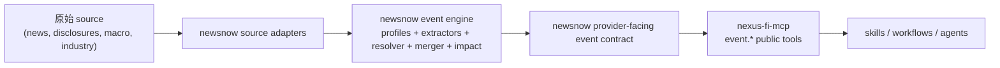

# 投资事件 Agent 接口方案

状态：使用中实现方案
最后更新：2026-04-19
范围：定义 `newsnow` 的事件输出应如何暴露给更大的 `nexus-fi` agent 链路
文档角色：provider / agent 边界方案
更新时机：provider-facing contract、边界规则或 agent 暴露策略变化时

相关 handoff：

- [investment-event-provider-handoff.md](./investment-event-provider-handoff.md)
- [investment-event-delivery-board.md](./investment-event-delivery-board.md)

## 0. 当前实现状态

这份方案已经不是理论稿，下面这些能力都已经在 `newsnow` 内实现：

- canonical backend investment projection：
  - [`../server/services/event-engine/investment-view.ts`](../server/services/event-engine/investment-view.ts)
- 显式 provider-facing HTTP routes：
  - [`../server/api/investment-events/latest.ts`](../server/api/investment-events/latest.ts)
  - [`../server/api/investment-events/search.ts`](../server/api/investment-events/search.ts)
  - [`../server/api/investment-events/entity.ts`](../server/api/investment-events/entity.ts)
  - [`../server/api/investment-events/[id].ts`](../server/api/investment-events/%5Bid%5D.ts)
  - [`../server/api/investment-watchlists/[id].ts`](../server/api/investment-watchlists/%5Bid%5D.ts)
  - [`../server/api/investment-watchlists/[id]/events.ts`](../server/api/investment-watchlists/%5Bid%5D/events.ts)
- 本地 provider MCP 已直接消费这些显式 routes：
  - [`../server/mcp/server.ts`](../server/mcp/server.ts)
- 本地 MCP 已增加任务型 scan/detail 工具：
  - `event_scan`
  - `event_get_detail`
  - `watchlist_scan`

剩余工作已经不是“发明 provider contract”，而是继续硬化它，并进一步缩小它与最终 `nexus-fi-mcp` public boundary 之间的差距。

## 1. 目的

这份文档定义投资事件系统在 agent-facing interface 上的正确边界。

关键架构判断是：

> `newsnow` 不是最终 public agent interface
> `newsnow` 是 event provider
> `nexus-fi-mcp` 才是 public agent abstraction layer

这个边界很重要，因为系统不能把 event-engine internals 直接泄露给 agent，也不能让 skill 必须理解 provider-specific semantics。

目标是同时满足：

- 人类看到的是有投资价值的事件视图
- agent 拿到的是结构化、可审计、投资导向的输出
- `newsnow` 保持为强 provider
- `nexus-fi-mcp` 保持为唯一 public MCP boundary

## 2. 端到端链路

## 2.1 三类 consumer surface

### A. Backend event engine

这是核心系统。它负责：

- source normalization
- canonical event generation
- fact extraction
- evidence linking
- event merging
- impact scoring

成功标准：

- semantic correctness
- 在该确定性时保持确定性
- auditability
- replayability
- 稳定的 storage 与 query semantics

### B. Frontend investor surface

这是 `newsnow` 内的人类产品面。它负责：

- 用投资者语言呈现事件
- 优先呈现对决策有帮助的信息
- 默认隐藏 engine internals
- 让 facts、evidence、next checks 对 discretionary investor 可读

成功标准：

- 易扫读
- 投资意义清晰
- facts 和 evidence 可读
- 极少默认泄露 engine/debug 术语

### C. Agent-facing interface

这是机器消费面。它负责：

- 暴露结构化 investment event 对象
- 保持 facts 和 evidence 可追溯
- 降低下游 prompt / workflow 的重建负担

成功标准：

- 结构化
- 可审计
- 稳定
- 不需要 agent 自己再猜事件意义

## 3. 分层职责

### 3.1 `newsnow`

`newsnow` 负责：

- canonical events
- facts
- evidence
- impact / investment interpretation
- canonical investment projection
- provider-facing HTTP / local provider MCP

### 3.2 `nexus-fi-mcp`

`nexus-fi-mcp` 负责：

- 将 provider contract 归一化成 public `event.*` contract
- 在多 provider 场景下做最终公共抽象
- 给 skill / workflow 暴露稳定的 public tool surface

### 3.3 Skills / workflows

skill 和 workflow 负责：

- 消费 public `event.*` contract
- 做任务级编排
- 不应自己重建 provider-specific 事件语义

### 3.4 Frontend 与 agent 的边界

frontend 和 agent 可以展示同一事件真相的不同 projection，但都不能重新定义：

- event family
- direction
- materiality
- tradability
- investment meaning

这些语义只能在 backend 算一次。

## 4. 当前问题

在这个边界明确之前，典型风险有：

- provider 和 public boundary 被混用
- 本地 MCP 既像 debug surface，又像 public contract
- 下游被迫从标题、自由文本、source id 重建事件意义
- frontend 与 agent 分别做一层自己的 business logic

这会直接违背：

- backend single source of truth
- structured and auditable interface
- downstream 不重建语义

## 5. 设计原则

1. `newsnow` 是 provider，不是最终 public MCP boundary
2. provider contract 必须默认带 facts、evidence、investment interpretation
3. debug-only 字段必须显式 gated
4. agent 不应被迫从自由文本重建事件意义
5. public `event.*` contract 的最终归一化应留在 `nexus-fi-mcp`

## 6. Contract split

### 6.1 `newsnow` 内的 provider-facing contract

`newsnow` 负责输出高质量、投资导向、可审计的 provider contract。

它应具备：

- stable field shape
- facts-first payload
- evidence trail
- backend-owned interpretation
- 明确的 default-safe / debug-only 边界

### 6.2 `nexus-fi-mcp` 内的 public agent contract

`nexus-fi-mcp` 负责：

- 将 `newsnow` provider contract 映射为 public `event.*`
- 做跨 provider 的统一命名和 guard semantics
- 保持 skill 侧 provider-agnostic

## 7. `newsnow` 的目标 provider contract

### 7.1 `InvestmentEventBrief`

它至少应承载：

- 事件主标题
- `eventFamily`
- `actionBucket`
- `whatHappened`
- `whoIsAffected`
- `subjectSummary`
- `publisherInstitution`
- `signalDirection`
- `materialityScore`
- `tradabilityScore`
- `authorityScore`
- `whyItMatters`
- `tradableNow`
- `whatToWatchNext`
- `riskOfMisread`
- `affectedMarkets`
- `affectedEntities`
- `relatedTopics`
- `publishedAt`

### 7.2 `InvestmentEventDetail`

detail 应在 brief 基础上补齐：

- `thesis` 风格的简洁解释
- `keyFacts`
- `evidence`
- `timelineSummary`
- `relatedEvents`

### 7.3 `InvestmentEventFact`

事实对象至少应支持：

- 用户可读 label
- metric name
- value / previous value / delta / unit
- direction 与 direction label
- effectiveAt
- confidence
- 可选 entity
- debug 模式下的 `factType` 与 `evidenceId`

### 7.4 `InvestmentEventEvidence`

证据对象至少应支持：

- source id / source name
- title / summary / url
- authority level / authority label
- publishedAt
- extractionStatusLabel
- debug 模式下的 `evidenceId`、`extractionStatus`、`sourceKind`

### 7.5 `InvestmentEntityRef`

entity ref 至少应支持：

- label
- entity id
- entity type
- optional code / market / canonical url

## 8. `nexus-fi-mcp` 的 public tool contract

`nexus-fi-mcp` 的 public `event.*` contract 应保留这些概念，但可以重命名：

- what happened
- why it matters
- who is affected
- tradable now
- what to watch next
- risk of misread
- facts
- evidence

但它不应要求 skill 知道：

- `newsnow` 的内部 fact type
- source kind internals
- merger / resolver 内部字段

## 9. 默认不应暴露的内容

默认 contract 不应暴露：

- engine lifecycle reason code
- parser family
- merger internals
- resolver internals
- raw evidence ids
- 机器内部 subtype code（如果已有用户可读 label）

这些信息只适合 debug path。

## 10. 投资语言规则

默认输出必须满足：

- 用投资语言说话，而不是 engine 语言
- summary 能直接服务于决策
- facts、evidence、interpretation 同时出现
- 不要求 agent 再从原文中回推“到底为什么重要”

## 11. 映射示例

### 11.1 Central bank operation

raw engine 里可能只有：

- `official_central_bank_operation`
- 一些 liquidity facts
- 央行 source evidence

provider-facing investment view 应该像：

- `eventFamily = rates_liquidity`
- `whyItMatters = "央行净投放偏正向，缓和短期资金面压力"`
- `tradableNow = "watch"`
- `whatToWatchNext = ["后续 OMO 续作力度", "回购利率变化"]`

### 11.2 Rumor clarification

raw engine 里可能只有：

- `clarification`
- company mention
- media evidence

provider-facing investment view 应像：

- `eventFamily = rumor_clarification`
- `whyItMatters = "公司对市场传闻作出回应，短期作用在于修正预期，而不是立即确认基本面变化"`
- `tradableNow = "watch"`
- `whatToWatchNext = ["正式公告", "订单/交付验证"]`

### 11.3 Industry news

raw engine 里可能只有：

- `industry_news`
- topic tags
- industry evidence

provider-facing investment view 应像：

- `eventFamily = industry_news`
- `whyItMatters = "更适合作为主题催化线索，仍需销量、产量、订单等硬数据确认"`
- `tradableNow = "watch"`

## 12. `newsnow` 的职责与剩余要求

### 12.1 保持显式 provider projection 层为 canonical

核心模块：

- [`../server/services/event-engine/investment-view.ts`](../server/services/event-engine/investment-view.ts)

职责：

- 将 `EventRecord` / `EventDetail` 转成 `InvestmentEventBrief` / `InvestmentEventDetail`
- 将内部 fact types 映射成投资语言 label
- 将 engine-only 字段从默认输出中移除
- 规范 affected entities 和 source summaries

### 12.2 保持 raw engine detail 只在 debug mode 下可见

不要删除 diagnostics。
但它们必须放在显式 `debug=true` 或 internal-only endpoint 后面。

### 12.3 继续把 `server/mcp/server.ts` 定位为本地 provider adapter，而不是 public boundary

`newsnow` 自带 MCP 仍然适合本地调试和 provider 使用，
但它不应再被误认为最终 public agent contract。

## 13. `nexus-fi-mcp` 需要承担的工作

`nexus-fi-mcp` 应该：

- 消费 `newsnow` provider-facing projection
- 暴露稳定的 public `event.*` tools
- 增加统一 metadata envelope 与 guard semantics
- 保持 provider 切换对 skill 透明

它不应该：

- 从 `newsnow` 的 raw text summary 重建事件意义
- 替 skill 解析 event-engine internals

## 14. 迁移顺序

### Phase A

在 `newsnow` 中：

- 定义 shared investment event projection types
- 增加 `investment-view.ts`
- 增加 provider-level projection tests

### Phase B

在 `newsnow` 中：

- 通过 event detail / list helpers 暴露 projection
- 将 debug / engine 字段放到显式 debug mode 后面

### Phase C

在 `nexus-fi-mcp` 中：

- 将 `event.*` tools 切到新 projection
- 停止依赖 provider-specific text formatting

### Phase D

在 skills / workflows 中：

- 只消费 public normalized `event.*` outputs
- 停止解析 provider internals

## 15. 决策

真正应该优化的，不是“把 `newsnow` MCP 文本写得更好看”。

正确的目标是：

1. `newsnow` 成为高质量 investment event provider
2. `nexus-fi-mcp` 成为唯一稳定的 public agent boundary
3. skills 消费 structured investment event objects，而不是 engine internals

这样才能同时守住架构边界和投资工作流的实用性。
