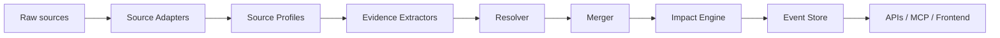

# 投资事件引擎升级方案（归档）

状态：已归档（旧方案）
最后更新：2026-04-11
范围：`newsnow` 从 rule-based event bus 升级为 investment-grade event engine 的早期系统方案

> 说明：这份文档已经被后续文档取代，仅保留历史参考价值。
> 当前有效文档请看：
> - [../investment-event-foundation-roadmap.md](../investment-event-foundation-roadmap.md)
> - [../investment-event-delivery-board.md](../investment-event-delivery-board.md)
> - [../investment-event-workstreams.md](../investment-event-workstreams.md)

## 1. 目的

这份旧方案当时的目标，是把仓库里的事件层从一个以规则和 source 前缀驱动的 `event-bus`，升级成专业投资事件引擎。

当时希望支撑的场景包括：

- 宏观监控
- 市场与行业跟踪
- 公告与披露跟踪
- watchlist
- morning report
- 策略与 signal system

## 2. 当时的现状判断

当时系统里并存两套相关但不同的能力：

1. `news` 层
   - 拉 source 数据
   - 归一成 `NewsItem[]`
   - 通过 `/api/s` 提供
   - 已经对实时阅读和 source-level monitoring 有用

2. `event-bus` 层
   - 吸收部分 source
   - 存 raw items
   - 做粗粒度 event type 分类
   - 聚类相似 item 为 event
   - 通过 `/api/events/*` 暴露

当时的主要问题被归纳为：

- `eventType` 大量依赖 source id 前缀推断
- `eventSubType` 主要靠标题和摘要关键词
- `NewsItem` 偏展示导向，而非 fact 导向
- 上游 source 自带的 structured fields 往往在进入事件层前被折损
- 事件合并过度依赖标题归一化
- importance 很粗
- 没有显式 market impact 模型
- 没有事件生命周期模型
- read / write 路径耦合
- 宏观和公告 facts 还不是一等数据

## 3. 当时确定的设计原则

这份旧方案最重要的几条原则后来大多被沿用下来：

### 3.1 事件语义应声明式而非散落式

不要把事件语义分散在 source id 前缀、标题正则和临时 if/else 里。
应让 source profile、extractor、resolver 成为清晰可维护的结构。

### 3.2 facts 必须是一等公民

事件不能只依赖标题和摘要，而应尽量落成 structured facts。

### 3.3 在 authoritative source 上，确定性逻辑必须占主导

对于交易所公告、官方宏观、政策发布这类 source，deterministic extraction 应优先于 LLM。

### 3.4 事件输出必须是投资导向的

输出不该只是“这是一条新闻”，而要能够支持：

- event family
- 方向
- 重要性
- tradability
- why it matters
- what to watch next

### 3.5 读写路径必须分离

query 不应继续触发 ingestion。
这条原则后来成为 foundation 的重要基线之一。

### 3.6 可观测性必须从一开始就是一等能力

不能把 monitoring 和 metrics 留到最后再补。

### 3.7 每个模型都要能安全降级

只要 extractor、resolver、LLM、entity linking 某一环失败，系统仍应能降级为保守但安全的 canonical event。

## 4. 当时目标架构

旧方案提出的目标管道是：

对应模块职责大致是：

- `source adapters`：把 source 拉进系统
- `profiles`：描述 source 语义、默认 family、parser family、时效等级等
- `extractors`：从 evidence 中抽 facts
- `resolver`：决定 family / subtype / entities / markets / topics
- `merger`：聚合同一事件
- `impact engine`：计算投资意义
- `event store`：存 canonical events / facts / evidence / timeline

## 5. 当时定义的数据模型方向

这份旧方案提出了后来 foundation 里基本都实现了的 6 类核心数据：

- `events`
- `event_sources`
- `event_evidences`
- `event_facts`
- `event_links`
- `event_timeline`

以及一批希望成为 canonical 字段的东西，例如：

- `eventFamily`
- `signalDirection`
- `materialityScore`
- `tradabilityScore`
- `authorityScore`
- `affectedMarkets`
- `topicTags`
- `primarySubject`
- `whatToWatchNext`

## 6. Source profile 模型

旧方案当时强调，要把 source semantics 从“代码里硬编码”升级为 profile-driven：

- `sourceKind`
- `parserFamily`
- `defaultEventType`
- `defaultEventFamily`
- `authorityLevel`
- `publicationClockPrecision`
- `latencyTier`

这一步后来演进成 foundation 里的 source profile / event profile 体系。

## 7. LLM 策略

这份旧方案并没有鼓吹让 LLM 成为主链路，反而明确了边界：

- 不要让 LLM 取代 authoritative structured source 上的 deterministic extraction
- LLM 只在长文本、模糊、低结构场景里有限辅助
- LLM 输出必须 schema constrained、evidence linked、可降级

这部分后来在 foundation roadmap 里被正式收口为 `Bounded LLM use only`。

## 8. 运维与质量要求

旧方案已经提前提出这些要求：

- latency metrics
- extractor success / failure metrics
- merge quality metrics
- fact extraction quantity / quality
- concurrency / idempotency
- versioning
- fixture-based replay tests
- failure / degradation matrix

这些要求后来分别落到了：

- quality gates
- replay / shadow
- runbook
- post-foundation latency remediation

## 9. 当时规划的 4 个升级阶段

### Phase 1：permanent foundation

目标：

- 建立 durable event semantics foundation

重点包括：

- schema 与 migration
- source profiles
- resolver / merger v2
- 第一批 structured official extractors
- read / write 分离
- observability 与 tests

### Phase 2：disclosure and industry expansion

目标：

- 向披露和行业域扩展

重点包括：

- structured extractor 覆盖 announcement 与 industry families
- 更丰富的 entity linking
- 更稳定的 merger

### Phase 3：bounded LLM augmentation

目标：

- 引入有边界的 LLM assistance

重点包括：

- policy / disclosure 的辅助抽取
- 模糊 merge review
- directional explanation pipeline

### Phase 4：production hardening

目标：

- backfill、quality metrics、shadow comparison、API stability、下游 adopt

## 10. 当时明确提出的反模式

旧方案明确禁止：

- 把 event semantics 放到 frontend
- 让 agent / skill 从原始 provider text 自己重建语义
- 用 LLM 覆盖 deterministic extractor
- 让 debug term 成为默认 user contract
- 在没有 replay / repair 路径时做大规模语义升级

这些不变量后来都进入了 AGENTS.md 与 foundation 文档。

## 11. 这份旧方案的历史意义

虽然这份文档已经被后续 roadmap / board / workstreams 取代，但它的历史意义还在：

- 它是事件系统从“事件总线”走向“投资事件引擎”的第一次系统化设计
- 它最早明确了 read/write separation、facts-first、bounded LLM、可观测性、单一语义源这些后续长期沿用的原则
- 它定义了后来 foundation 阶段大部分真正落地的模块方向

如果你今天回看这份文档，应该把它当作“架构思想的起点”，而不是当前执行真相。
