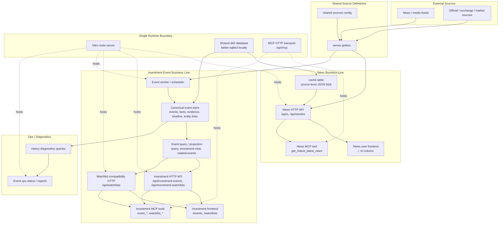
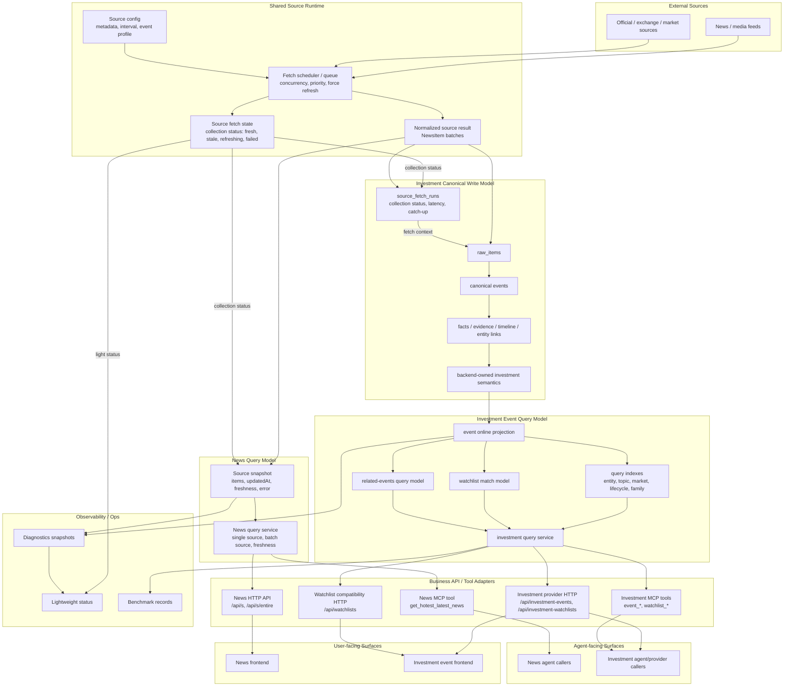
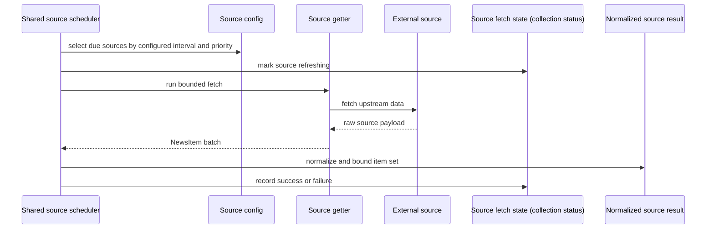
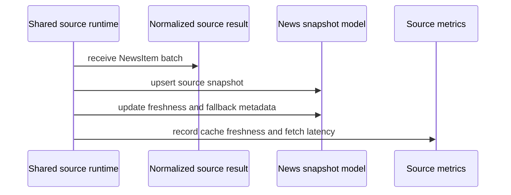
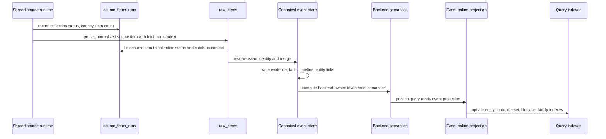
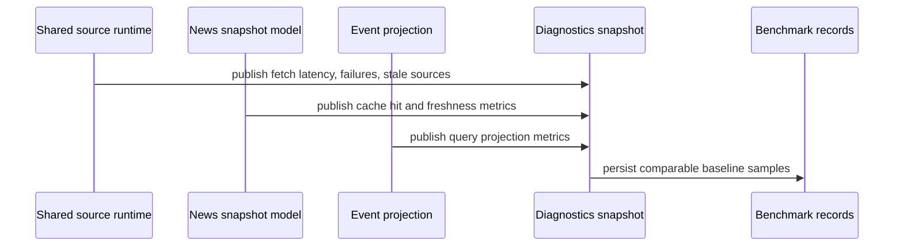
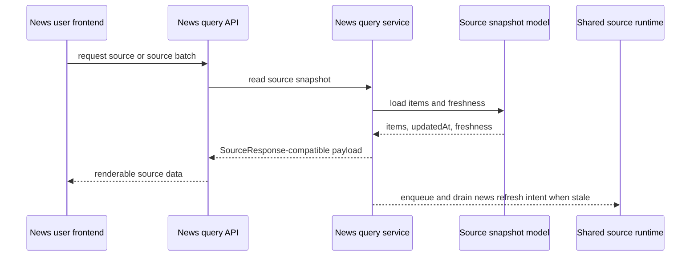
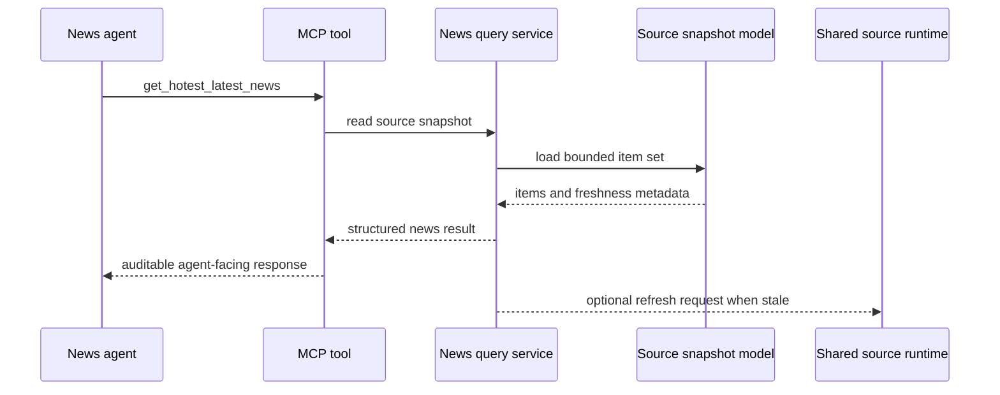
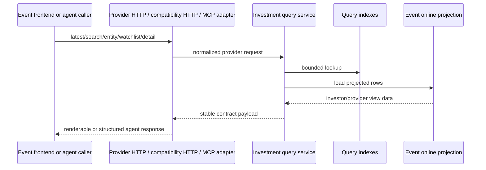
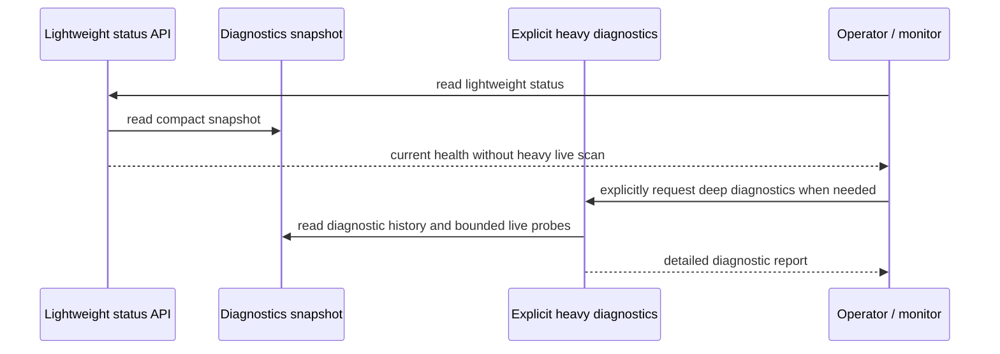

# NewsNow Surface Performance Rearchitecture Technical Design

状态：审批通过；已实施；最终架构和 review follow-up 已闭环
最后更新：2026-04-25
范围：`newsnow` 双业务线系统性性能优化的目标架构、模块边界、迁移和验证方案

## 1. 问题陈述

当前 `newsnow` 的性能问题不是单点慢查询，而是 surface 层缺少统一性能架构。

主要问题：

- 新闻用户请求可能直接触发上游 source fetch
- 新闻缓存是 source-level JSON blob，缺少正式 freshness / snapshot model
- 投资事件 canonical store 同时承担 truth storage 和在线 query workload
- 投资事件列表、watchlist、detail related events 存在读放大和 fan-out
- MCP tools 直接复用当前 HTTP 热路径，缺少 agent-facing 性能边界
- ops diagnostics 和在线查询共享数据库资源
- 前端两条业务线都存在重复请求或重复计算放大器

## 2. 设计目标

- 一个 backlog 覆盖双业务线
- shared source runtime 明确化
- 新闻线建立稳定 online snapshot / query model
- 投资事件线建立稳定 online query model
- user-facing 和 agent-facing surface 都走明确 query service
- canonical event store 保持 backend truth，不被在线查询需求污染
- ops diagnostics 与在线 surface 解耦
- 新闻业务线和投资事件业务线按未来可拆成两套独立系统来解耦
- 后续 sprint 可分步实施，但每个 sprint 都必须交付最终架构的一部分，不允许形成阶段性短期目标

## 3. 架构图

### 3.1 图例、箭头和分层原则

这组图不是调用栈，也不是文件依赖图。它表达的是系统边界、主要数据依赖和性能责任边界。

箭头含义：

- `A --> B`：`B` 依赖 `A` 产出的数据、状态或服务能力。它表示主依赖方向，不表示一定是同步函数调用。
- `A -. "same process" .-> B`：虚线表示运行时共置或共享资源，不表示业务数据流。
- sequence diagram 中的 `->>`：请求、调用、写入或事件投递。
- sequence diagram 中的 `-->>`：响应、返回结果或异步产出。

大方块含义：

| 方块 | 含义 | 为什么这样画 |
| --- | --- | --- |
| `External Sources` | 外部新闻、媒体、官方、交易所、市场源 | 它们是所有数据的起点，也是延迟和失败的外部来源 |
| `Shared Source Runtime` | 统一的 source 配置读取、调度、抓取、状态和规范化层 | 两条业务线都依赖 source 配置和 source getter，必须先把共享资源边界画出来 |
| `News Query Model` | 面向新闻业务线的在线读取模型 | 新闻前端和新闻 MCP 都不应直接承受慢源抓取成本 |
| `Investment Canonical Write Model` | 投资事件的 backend truth 写模型 | 这里保存 canonical event、facts、evidence、timeline、entity links 和 investment semantics |
| `Investment Event Query Model` | 面向投资事件在线查询的受控投影和索引 | 在线查询不应继续直接压 canonical store 做重型拼装 |
| `Business API / Tool Adapters` | provider HTTP、compatibility HTTP 和 MCP tools | adapter 负责 contract shape、权限、过滤默认值和格式适配，不负责重算业务语义 |
| `User-facing Surfaces` | 新闻前端和投资事件前端 | 人类用户的性能体验要单独验收 |
| `Agent-facing Surfaces` | 新闻 agent caller、投资事件 agent/provider caller | agent/provider 调用也有性能合同，不能只是复用任意 HTTP 热路径 |
| `Observability / Ops` | 轻量状态、诊断快照、benchmark 记录 | 性能优化必须可验证，ops 也不能拖慢在线路径 |

分层原则：

1. `Layer 0 External Input`：外部 source。
2. `Layer 1 Shared Runtime`：统一抓取、调度、状态、规范化。
3. `Layer 2 Write / Snapshot Models`：新闻 snapshot 与投资事件 canonical write model。
4. `Layer 3 Online Query Models`：新闻 query service 与投资事件 projection / index / query service。
5. `Layer 4 Business API / Tool Adapters`：provider HTTP、compatibility HTTP 和 MCP tools。
6. `Layer 5 Surfaces and Callers`：user-facing frontend 与 agent-facing callers。
7. `Cross-cutting Observability`：跨层采集指标，但读取路径必须轻量化。

当前架构图的目的，是暴露两条业务线如何共享进程、DB、source getter，以及为什么会互相放大性能问题。目标架构图的目的，是约束后续 sprint 必须把生产、查询、消费和观测边界拆清楚。

表达边界：

- `当前架构` 只描述已经在代码里存在的事实。
- `目标架构` 描述本 backlog 要收敛到的系统形态，不表示当前已经全部落地。
- `候选实现方向` 是后续 sprint 需要验证的实现选项，不能被当作已接受技术决策。
- `sprint` 是执行切片，不是阶段性架构；任何 sprint 产物都必须能继续演进到最终目标。
- 如果一个节点被两条业务线共享，文档必须直接写出两条业务线如何使用它，不能只画到其中一条业务线。
- provider HTTP、compatibility HTTP 和 MCP tools 都是 surface adapter；它们可以复用 query service，但不能成为新的业务语义来源。
- 任何跨业务线共享都必须说明是 infrastructure sharing、neutral contract sharing 还是 business coupling；目标架构只允许前两者，禁止 business coupling。

### 3.2 当前架构

当前架构的核心问题是：两条业务线已经同时存在，但性能边界仍然主要靠各 surface 自己组织。

当前架构里的主要性能风险：

- 新闻 user request 可以直接触发 upstream source getter。
- 新闻 MCP tool 继承 `/api/s` 的 cache miss 行为。
- 投资事件 online query 直接压 canonical event store。
- watchlist、related-events、ops diagnostics 会继续放大 event query 成本。
- 两条业务线共用进程、database 和 source getter，没有统一 source runtime 资源边界。

### 3.3 目标架构

目标架构把系统拆成共享 source runtime、新闻查询模型、投资事件查询模型、API / tool adapter、user / agent caller 和观测层。

目标架构的核心变化：

- source fetch 从 user request 中抽离到 shared source runtime。
- source config 是声明式配置，来自 `shared/pre-sources.ts`、`shared/sources.ts` 和相关 metadata；它不是运行时状态。
- source fetch state 是共享的数据采集状态，不是新闻线私有状态。新闻线用它表达 snapshot freshness / fallback；投资事件线用它记录 `source_fetch_runs`、ingest latency 和 backlog catch-up，并把 fetch context 关联到 `raw_items`。
- 新闻业务线从 source-level JSON cache 过渡到 source snapshot / query service。
- 投资事件业务线从 canonical store 直查过渡到 online projection / index / query service。
- provider HTTP、compatibility HTTP 和 MCP tools 都不再直接继承无边界热路径，而是按业务线走 query service。
- ops status 优先读轻量状态或 diagnostics snapshot，而不是临时跑全量重型统计。
- 新闻线和投资事件线的业务 query model、schema ownership、semantic ownership 和 surface contract 必须保持可拆分边界。

### 3.4 架构变更边界

本 backlog 涉及架构变更，因此后续 implementation 必须同时维护两张图的对应关系：

- 当前架构图用于解释为什么现状会产生性能问题。
- 目标架构图用于约束 sprint 实施方向。

每个 sprint 的技术设计都必须说明它推进了目标架构里的哪一块，以及没有触碰哪些块。
每个 sprint 也必须说明是否引入 shadow path、dual-read、feature flag、compatibility fallback；如果引入，必须同时写清退出条件和删除边界。

### 3.5 双业务线解耦矩阵

新架构必须把“短期共享基础设施”和“长期业务耦合”分开。目标是允许未来把新闻业务线和投资事件业务线拆成两套独立系统，而不是只在同一个进程里做性能优化。

| 范畴 | 是否允许共享 | 解耦要求 |
| --- | --- | --- |
| Shared Source Runtime | 允许 | 只能暴露 source config、collection status、normalized source result、fetch context 等中立 contract；不能暴露 news snapshot 或 investment semantics |
| Source config / metadata | 允许 | 配置可以共享，但业务线只能读取自己的 profile / interval / source enablement，不得通过配置理解另一条业务线的业务模型 |
| Runtime hosting | 短期允许 | Nitro process、db0 / SQLite、MCP transport 可以短期共置，但代码必须避免跨业务线 service import、跨业务线 fallback 和跨业务线 hot path |
| Observability / Ops | 允许 | 指标可以进入同一 diagnostics snapshot，但必须带 business line 维度；不能用 investment event ops status 代表 news 线健康 |
| News Query Model | 禁止与事件线共享 | 只服务 `/api/s`、`/api/s/entire`、新闻前端和新闻 MCP；不得依赖 canonical event store、event projection 或 investment semantics |
| Investment Event Query Model | 禁止与新闻线共享 | 只服务 investment provider HTTP、watchlist compatibility HTTP、事件前端和 investment MCP；不得依赖 news snapshot、news cache blob 或新闻 frontend 状态 |
| Business semantics | 禁止共享来源 | 新闻线不产生 investment semantics；事件线 investment semantics 只由 backend event engine 产出 |
| Surface contracts | 按业务线分离 | news surface contract 与 investment provider / compatibility / MCP contract 必须独立演进；adapter 只做 shape 和权限适配 |
| Frontend state | 禁止共享 | 新闻 frontend 状态、事件 frontend 状态、watchlist 状态不能互相作为数据来源 |
| Database schema ownership | 按业务线分离 | 同库部署时也必须按表 / DAO / migration ownership 分离；禁止为了方便查询直接 join 另一条业务线 owned tables |

拆分准备要求：

- 每个新增 service 必须声明 owner：`news`、`investment-event`、`shared-source` 或 `ops`。
- `shared-source` 只能依赖 shared config、source getter 和 neutral source contracts。
- `news` 可以依赖 `shared-source`，不能依赖 `investment-event`。
- `investment-event` 可以依赖 `shared-source`，不能依赖 `news`。
- `ops` 可以读两条业务线的指标 snapshot，但不能进入任何 user-facing / agent-facing 热路径。
- 后续 sprint 如果引入跨业务线 import、跨业务线 SQL join、跨业务线 fallback，必须先证明它是临时迁移桥，并在同一 sprint 给出删除边界。

Sprint 1 schema ownership baseline 校正版（2026-04-25）：

校正依据：

- active DB path：`/Users/huangjiahao/workspace/industry-investment-suite/state/events/db.sqlite3`
- active DB tables：`cache`、`raw_items`、`source_fetch_runs`、`events`、`event_evidence`、`event_sources`、`event_facts`、`event_timeline`、`event_metrics`、`entity_links`、`watchlists`
- code-defined but absent in active event DB snapshot：`user`
- planned contracts：`source_snapshots` / `source_items`、`event_projection`、`event_query_indexes`、`watchlist_match_model`、`related_events_query_model`、`event_projection_consistency`、diagnostics snapshot tables

| Table / contract | 当前代码位置 | Owner | 说明 |
| --- | --- | --- | --- |
| `cache` | `server/database/cache.ts` | `news` | active DB confirmed；当前新闻 source cache；Sprint 2 将收敛为 News Snapshot Model 或迁移到新的 news-owned snapshot tables |
| future `source_snapshots` / `source_items` | Sprint 2 新增或替代 | `news` | 如果新增，必须只服务新闻读取模型，不承载投资事件语义 |
| `source_fetch_runs` | `server/database/events.ts` | `shared-source` | active DB confirmed；当前由 event database 模块创建和访问，是 migration bridge；目标语义是中立 collection status、latency 和 catch-up context |
| `raw_items` | `server/database/events.ts` | `investment-event` | active DB confirmed；投资事件 write model 的 source item 落地点，关联 fetch context 后进入 canonical event store |
| `events` | `server/database/events.ts` | `investment-event` | active DB confirmed；canonical event truth 与 backend-owned investment semantics |
| `event_evidence` | `server/database/events.ts` | `investment-event` | active DB confirmed；evidence truth，供 provider / frontend / MCP projection 消费 |
| `event_sources` | `server/database/events.ts` | `investment-event` | active DB confirmed；event-source linkage truth |
| `event_facts` | `server/database/events.ts` | `investment-event` | active DB confirmed；structured facts truth |
| `event_timeline` | `server/database/events.ts` | `investment-event` | active DB confirmed；canonical event timeline truth |
| `entity_links` | `server/database/events.ts` | `investment-event` | active DB confirmed；entity and market linkage truth |
| `event_metrics` | `server/database/events.ts` | `investment-event` | active DB confirmed；event-engine metrics table；ops 可以读取 snapshot，但不拥有事件语义 |
| `watchlists` | `server/database/watchlists.ts` | `investment-event` | active DB confirmed；investment watchlist state；compatibility routes 不能拥有独立 query logic |
| `user` | `server/database/user.ts` | `ops` | code-defined but absent in active event DB snapshot；runtime/auth supporting table，不属于 news 或 investment event business query model |
| future `event_projection` | Sprint 3 新增或明确 | `investment-event` | Investment Event Query Model 的 online projection；只能投影 canonical event truth，不能成为第二套语义源 |
| future `event_query_indexes` | Sprint 3 新增或明确 | `investment-event` | 支撑 latest / search / entity / topic / source / market / lifecycle / family 的查询索引 |
| future `watchlist_match_model` | Sprint 3 设计、Sprint 4 切换 | `investment-event` | 支撑 watchlist event matching；不能拥有 watchlist metadata lifecycle |
| future `related_events_query_model` | Sprint 3 设计、Sprint 4 切换 | `investment-event` | 支撑 event detail related-events 查询，替代 route-level fan-out |
| future `event_projection_consistency` | Sprint 3 新增或明确 | `investment-event` | 记录 canonical truth 与 online projection 的 anchor / checksum / repair 状态 |
| future diagnostics snapshot tables | Sprint 5 新增 | `ops` | 只能服务 observability，不能进入 user-facing / agent-facing 热路径 |

Sprint 2 起任何新增 SQL 查询都必须引用更新后的 owner baseline。

`source_fetch_runs` owner 张力处理要求：

- 当前事实：`source_fetch_runs` 的 DDL、写入和查询仍在 `server/database/events.ts` 中；这不是目标态 owner 边界。
- 目标 owner：`source_fetch_runs` 属于 `shared-source`，因为它表达 collection status、latency、failure 和 catch-up context，不表达 investment semantics。
- Sprint 1 schema 校正已显式标记当前 `server/database/events.ts` 中的 DDL / DAO / write path 是 migration bridge，不能被当成最终 owner。
- 当前访问清单：
  - DDL：`server/database/events.ts` `init()` 创建 `source_fetch_runs`
  - indexes：`idx_source_fetch_runs_source_fetched`、`idx_source_fetch_runs_status_source_fetched`
  - writes：`recordSourceFetchRun()`
  - reads：`getLastFetchedAtBySourceIds()`
  - cross-owner ops reads：`getQualitySnapshot()` 和 `getOperationalLatencyDiagnostics()` 中的 `LEFT JOIN source_fetch_runs`
- 当前 `server/database/events.ts` 中面向 ops diagnostics 的 `LEFT JOIN source_fetch_runs` 标记为 `cross-owner: ops reads shared-source collection status`，并在后续实现中迁移到 ops diagnostics snapshot 或 shared-source read API。
- Sprint 2 Shared Source Runtime 设计必须给出 `source_fetch_runs` DDL / DAO 从 event table 模块分离的 milestone；如果暂不迁移，必须给出保留原因、访问清单和删除边界。

### 3.6 最终目标定义

本 backlog 的最终目标不是“阶段性变快”，而是建立可持续执行、可持续验证、可持续拆分的 surface performance architecture。

最终架构完成时必须满足：

- 新闻 user-facing、新闻 agent-facing、投资事件 user-facing、投资事件 agent-facing 四类 surface 都有稳定 query service 和性能 contract。
- 常规 user / agent request 不直接承担 upstream source fetch、canonical store 重型拼装、route-level fan-out 或 ops diagnostics 成本。
- 新闻业务线的读取模型完整收敛到 News Query Model；投资事件业务线的读取模型完整收敛到 Investment Event Query Model。
- canonical event store 只承担 investment event truth 和 write model 责任，不继续被在线查询需求污染。
- shared source runtime 只承担中立采集、状态和规范化职责，不包含新闻展示模型或投资事件语义。
- observability 覆盖两条业务线和四类 surface，但不成为在线热路径同步依赖。
- 所有兼容层、shadow path、dual-read、feature flag、fallback 都有明确保留理由和删除边界；没有“暂时这样长期保留”的路径。
- 两条业务线在模块依赖、schema ownership、query service、surface contract 和 frontend state 上保持可拆分。

Backlog-level definition of done：

- 已发现性能问题全部映射到最终架构中的明确模块，并有对应实现或明确不再适用的证据。
- 每个 sprint 的交付物都能连接到最终目标架构，没有孤立短期优化。
- baseline、benchmark、HTTP latency、MCP smoke、frontend request count、worker active / inactive 对照均通过。
- 没有未登记的跨业务线 import、跨业务线 SQL join、跨业务线 fallback 或跨业务线语义重算。
- `delivery-status.md` 中所有 blocker 被关闭或转化为明确的新 backlog。

## 4. 数据流

数据流必须分开看：生产链路负责把外部 source 变成可读取模型，消费链路负责 frontend、MCP 和 ops 如何读取这些模型。两者不能混在一张图里，否则容易把“写模型如何产生 truth”和“读请求如何消费 truth”混成一条同步链路。

### 4.1 数据生产链路

#### 4.1.1 Shared source production

生产要求：

- source fetch 必须有并发、超时、优先级和失败状态边界。
- 常规 user request 不直接执行这个生产链路。
- 新闻线和投资事件线都消费这里产生的规范化 source result 和 fetch state。

#### 4.1.2 News snapshot production

生产要求：

- 新闻 snapshot 是新闻消费链路的稳定读取对象。
- snapshot 至少要表达 `items`、`updatedAt`、freshness、last success、last error。
- 是否落成 `source_snapshots`、`source_items` 或扩展 `cache` table，后续 sprint 决策。

#### 4.1.3 Investment event production

当前 / 目标差异：

- 当前代码中，`server/services/event-engine/scheduler.ts` 自行拉取 source、自行写入 `raw_items`，尚未经过 Shared Source Runtime 统一调度。
- 下图描述目标生产链路：Shared Source Runtime 负责中立采集、collection status 和 normalized source result；Investment Event Write Model 只消费 fetch context 和 normalized source item。
- Sprint 1 必须决策事件线如何接入 Shared Source Runtime：复用 shared fetch result、通过 neutral fetch contract 拉取，或保留短期独立拉取迁移桥。无论采用哪种迁移方式，最终目标都不能让事件线长期绕过 Shared Source Runtime 自行维护另一套 source fetch 状态。

生产要求：

- canonical event store 继续是 investment event truth。
- online projection 和 indexes 是 truth 的受控投影，不是第二套语义源。
- 投资语义不能移动到 frontend、MCP formatter、prompt 或 downstream agent。
- source fetch state 不是只给新闻线使用；事件线用它支撑 `source_fetch_runs`、latency diagnostics 和 outage catch-up 判定。
- `source_fetch_runs` 不产生 investment semantics；它只记录采集运行上下文，`raw_items` 到 canonical events 的事件语义仍由 backend event engine 产出。

#### 4.1.4 Observability production

生产要求：

- diagnostics 可以深，但不应在轻量 status 请求时临时全量计算。
- benchmark 必须覆盖 news user-facing、news agent-facing、investment user-facing、investment agent-facing。

### 4.2 数据消费链路

消费链路只描述读取路径。若消费过程中发现数据 stale，只能把 refresh 请求交还给生产链路，不在消费图里继续展开 upstream fetch。

#### 4.2.1 News user-facing consumption

消费要求：

- 常规读取优先命中 snapshot。
- stale 时通过 Shared Source Runtime 提交并后台执行 news refresh intent，但不让用户请求同步承担慢源成本。
- force refresh 必须走受控路径，带权限、并发和 fallback 语义。

#### 4.2.2 News agent-facing consumption

消费要求：

- agent 不直接触发无边界 source getter。
- 返回结果应包含 freshness 或 fallback 语义。
- 后续可以在保持兼容的前提下从 link list 升级为 structured content。

#### 4.2.3 Investment event user-facing and agent-facing consumption

消费要求：

- canonical write model 继续是 backend truth。
- online query model 是 canonical truth 的受控投影，不是第二套语义源。
- event-reading frontend 和 MCP tools 都消费同一 query service。
- event-reading provider HTTP、compatibility HTTP 和 MCP adapter 都消费同一 query service。
- watchlist 和 related-events 也必须进入 query service，不在 route 层自行 fan-out。
- 当前 `/api/watchlists` 仍是 watchlist list/upsert 的 metadata compatibility path；目标不是删除它，也不是把 metadata lifecycle 并入 Investment Event Query Model，而是保证其中的 event-read 路径与 `/api/investment-watchlists`、event-read MCP tools 共享同一事件查询模型和语义投影。

#### 4.2.4 Ops consumption

消费要求：

- light status 不临时触发全量重型统计。
- diagnostics 可以保留深度分析，但应由 snapshot 或显式诊断入口承载。
- news 和 investment event 都必须纳入观测。

## 5. 模块边界

### 5.1 Shared Source Runtime

职责：

- 统一 source getter 调度
- 控制 source fetch 并发
- 管理 stale / fresh / failed / refreshing 状态
- 支持 force refresh，但不让常规 user request 直接承担慢源成本
- 为新闻 snapshot 和事件 ingest 提供同一套 source fetch 事实

候选影响文件：

- `shared/sources.ts`
- `shared/pre-sources.ts`
- `server/getters.ts`
- `server/api/s/index.ts`
- `server/services/event-engine/scheduler.ts`
- 新增或调整 source runtime service

Sprint 1 source scheduling framework：

- `backfill catch-up`：最高优先级，用于恢复中断后的数据缺口；必须限流，避免长期压制在线 freshness。
- `force refresh`：高优先级，只能走受控入口，必须有权限、并发和 fallback 语义。
- `routine fetch`：常规优先级，按 source interval、profile 和 freshness 状态调度。
- 同一优先级内按 source profile、last success、failure backoff 和 queue age 排序。
- 新闻线和投资事件线只能通过 neutral priority class 提交 refresh intent，不能直接抢占另一条业务线的内部热路径。

Sprint 1 neutral priority class interface 候选要求：

- Sprint 1 不必立即定死实现形态，但必须比较至少三类方案：in-process source runtime service、persistent queue table、event-bus / worker queue。
- 每个候选都必须说明如何表达 `businessLine`、`sourceId` / source profile、`priorityClass`、`reason`、`requestedAt`、dedupe key、deadline / TTL、max concurrency 和 fallback policy。
- `priorityClass` 至少包含 `backfill_catch_up`、`force_refresh`、`routine_fetch`；业务线不能直接提交自定义绝对优先级。
- interface 必须保证新闻线和投资事件线只能提交 neutral refresh intent，不能直接调用另一条业务线的 hot path 或私有 scheduler。
- Sprint 1 必须给出推荐方案和迁移路径；如果先采用 in-process 方案，必须说明未来迁移到 persistent queue 或 worker queue 的兼容边界。

### 5.2 News Snapshot Model

职责：

- 替代长期依赖 source-level JSON cache blob 的在线读取方式
- 保存 source 最新 snapshot、freshness、last fetch status、last successful fetch、error state
- 支持 `/api/s`、`/api/s/entire`、新闻 MCP tool、新闻前端列流
- 新闻 snapshot 只表达新闻读取状态和 source freshness，不承载投资事件语义

候选实现方向：

- 扩展现有 `cache` table，使其成为 source snapshot table
- 或新增 `source_snapshots` / `source_items` 表
- 保留兼容响应 `SourceResponse`

设计底线：

- News Snapshot Model 不能继续把 source-level JSON blob 全文解析作为唯一读取方式。
- Sprint 2 至少要提供字段级查询能力，支撑 single source read、batch read、freshness lookup 和 error / fallback lookup。
- 如果继续扩展 `cache` table，必须说明哪些字段从 JSON blob 提升为可索引列。
- 如果新增 `source_snapshots` / `source_items`，必须说明主键、source_id、updatedAt、publishedAt、title/url 去重键、freshness/error 字段和批量读取索引。

候选影响文件：

- `server/database/cache.ts`
- `server/api/s/index.ts`
- `server/api/s/entire.post.ts`
- `src/hooks/query.ts`
- `src/components/column/card.tsx`
- `server/mcp/server.ts`

Sprint 2 gate：

- `Cache.getEntire` 必须移除字符串拼接 SQL，改为 parameterized query 或等效安全查询。
- `/api/s/entire` 必须明确收敛到 News Query Service batch read，或者明确仅保留为兼容 bulk read adapter。
- 如果 `/api/s/entire` 保留为兼容 adapter，它不能绕过 News Snapshot Model 直接依赖 source-level JSON blob。
- Sprint 1 必须先给出 `/api/s/entire` performance contract 草案：batch size、latency budget、partial failure 行为、fallback 语义和是否需要分页。

### 5.3 Canonical Event Write Model

职责：

- 继续保存 canonical events、facts、evidence、timeline、entity links 和 investment semantics
- 不直接承担所有 online query workload
- 保持 repair、backfill、shadow、quality gates 能力

候选影响文件：

- `server/database/events.ts`
- `server/services/event-engine/scheduler.ts`
- `server/services/event-engine/impact.ts`
- `server/services/event-engine/subject-resolution.ts`
- `server/services/event-engine/watch-target-candidates.ts`

### 5.4 Investment Event Query Model

职责：

- 为 `latest/search/entity/watchlist/detail/related` 提供稳定读模型
- 预先持久化或索引在线查询需要的字段
- 避免请求期重复分类、impact 补算、topic 归一和相关子查询
- 让 count 与 list 共享轻量查询策略
- 进入 implementation 前完成 `investment-view.ts` 函数级 write-time vs query-time 分类

候选实现方向：

- projection table
- index table
- materialized snapshot
- canonical table denormalized columns
- 以上的组合

Sprint 3 gate：

- 硬性条件：projection / index schema 必须兼容 latest/search/entity/watchlist/detail/related-events 的查询模式；即使 watchlist 和 related-events 的 surface 切换安排在 Sprint 4，Sprint 3 的 schema 也不能排斥这些查询。
- 硬性条件：`investment-view.ts` 中的 event family、entity projection、display formatting、fact projection、evidence projection、action bucket、score insight 等逻辑必须先完成 write-time vs query-time 分类。
- 例外条件：如果个别 projection 字段暂时保留在 read-time，必须单独记录原因、成本上限、迁移条件和退出 sprint。
- 校验条件：projection 更新后必须能校验 canonical truth 的 row count、updated anchor 或关键字段 checksum；校验失败时 projection 进入 repair / fallback，不能继续服务错误投影。
- SQL owner 条件：所有新增 SQL 查询必须声明访问表和 owner；跨 business line 表查询必须在 sprint 设计和 PR 中显式标记，否则 code review 退回。

候选影响文件：

- `server/database/events.ts`
- `server/services/event-engine/query.ts`
- `server/services/event-engine/investment-view.ts`
- `server/services/investment-query/service.ts`
- `server/database/event-projections.ts`
- `server/database/watchlists.ts`
- `server/api/investment-events/*`
- `server/api/investment-watchlists/*`

### 5.5 API / Agent Surface Adapter Layer

职责：

- 将 provider HTTP、compatibility HTTP 和 MCP tools 按业务线映射到稳定 query service 或 metadata service
- 新闻工具消费 News Snapshot Model
- 投资事件 event-read provider HTTP、watchlist event-read compatibility HTTP 和 event-read MCP tools 消费 Investment Event Query Model
- watchlist metadata compatibility routes 和 metadata MCP tools 只管理 watchlist state，不拥有独立事件查询逻辑
- 返回结构保持清晰、可审计，不要求 agent 反推语义
- surface adapter 只做 contract shape、权限、过滤默认值和格式适配，不重新计算业务语义

候选影响文件：

- `server/api/investment-events/*`
- `server/api/investment-watchlists/*`
- `server/api/watchlists/*`
- `server/mcp/server.ts`
- `server/mcp/projection.ts`
- `server/api/mcp.post.ts`

### 5.6 User Surface Layer

职责：

- 新闻前端减少批量 preload 后的重复 refetch
- 新闻前端显示稳定 freshness / refresh state
- 事件前端减少重复派生计算和多余请求
- watchlist detail 不再按 focusMode 触发双请求
- 清理已知 listener / timer 泄漏

候选影响文件：

- `src/components/column/*`
- `src/hooks/query.ts`
- `src/hooks/useAutoRefresh.ts`
- `src/routes/events.tsx`
- `src/routes/events.$eventId.tsx`
- `src/routes/watchlists.tsx`
- `src/routes/watchlists.$watchlistId.tsx`
- `src/hooks/useRelativeTime.ts`
- `src/components/common/*`

### 5.7 Observability Layer

职责：

- 记录新闻 source fetch / cache / refresh 指标
- 记录投资事件 query / projection / worker 指标
- 将重型 diagnostics 与轻量 status 分离
- 支持 sprint 验收和 regression detection

候选影响文件：

- `server/api/ops/events/status.ts`
- `server/database/events.ts`
- 新增 news / source ops status 或 snapshot

## 6. 可持续实施策略

实施策略必须从最终目标倒推，而不是先做短期热修再另起重构。下面的 step 是 execution order，不是阶段性目标；每一步都必须留下可继续演进到最终架构的模块边界、contract 和验证记录。

### Step 1：建立 baseline 与最终目标映射

- 记录新闻线 API、MCP、前端列流请求数和延迟
- 记录投资事件 API、MCP、前端事件页和 watchlist 延迟
- 记录 worker active / inactive 对在线查询的影响
- 单独记录 event detail endpoint latency，并拆分主详情查询与 related-events fan-out 成本
- 把每个已发现性能问题映射到最终架构中的 responsible module
- 输出四个物理形态问题的推荐方向和 trade-off：News Query Model、Investment Event Query Model、Shared Source Runtime、Observability / Ops
- 输出 `/api/s/entire` performance contract 草案
- 输出 Shared Source Runtime 调度优先级框架
- 输出 neutral priority class interface 候选对比、推荐方案和迁移路径
- 输出验证命令入口清单，补齐新闻线 benchmark / diagnostics 缺口
- 校正当前 schema ownership baseline，形成 Sprint 2 起 SQL owner declaration 的 `table -> owner` ground truth
- 标记 `source_fetch_runs` 当前/目标 owner 张力，列出 current DDL / DAO / write path 和 ops `LEFT JOIN` 的 cross-owner 处理方式

### Step 2：Shared Source Runtime

- 先建立 source refresh 状态和并发边界
- 分离或封装 `source_fetch_runs` DDL / DAO，使其从 event table 私有实现过渡为 shared-source contract
- 将 `/api/s` 的常规路径改为优先读取 snapshot
- force refresh 保留，但必须有明确权限、并发和 fallback 语义
- 如果保留旧 `/api/s` fetch path 作为兼容 fallback，必须记录退出条件
- 建立 SQL owner declaration 规则：新增查询必须声明访问表、owner 和是否跨 business line

### Step 3：News Snapshot Model

- 将 source cache 从无结构 blob 过渡到 snapshot contract
- 保持 `SourceResponse` 兼容
- 调整新闻前端和新闻 MCP tool 消费 snapshot freshness
- 兼容响应只能作为 adapter 责任，不能阻止 News Query Model 独立成型
- 修复 `/api/s/entire` / `Cache.getEntire` 的字符串拼接 SQL
- 明确 `/api/s/entire` 是 News Query Service batch read，还是 compatibility bulk read adapter

### Step 4：Investment Event Query Model

- 建立在线投影字段和索引策略
- 收敛 `latest/search/entity`
- 先完成 `investment-view.ts` 函数级 write-time vs query-time 分类
- 同步设计 watchlist 和 related-events 的索引策略
- 在 Sprint 3 设计中列出 route-level 边界，明确 Sprint 3 切换范围和 Sprint 4 接手范围
- 收敛 watchlist query
- 收敛 detail related-events
- 收敛 `/api/investment-watchlists` 与 `/api/watchlists` 的事件读取路径
- 消灭请求期语义补算依赖
- shadow projection、dual-read 或 denormalized fields 必须标明是否为最终读模型的一部分；如果不是，必须标明删除边界

### Step 5：Surface Cleanup

- 新闻前端请求合并与刷新节奏治理
- 事件前端重复派生计算治理
- listener / timer cleanup 修复
- provider HTTP、compatibility HTTP 和 MCP tool 调用路径收敛
- surface cleanup 不能只做 UI 层掩盖，必须移除对应后端热路径放大器

### Step 6：Observability / Ops Decoupling

- 拆分轻量 status 与重型 diagnostics
- 补新闻线指标
- 将 benchmark 记录进入 delivery status
- 用最终目标的 definition of done 关闭 backlog，而不是按单个 sprint 关闭
- 将 projection consistency check、source queue priority latency、news snapshot freshness 纳入 diagnostics snapshot

## 7. Sprint 拆分建议

Sprint 1：Baseline 与 shared source runtime 设计落地

必须产出：

- 四个物理形态问题的推荐方向和 trade-off
- `/api/s/entire` performance contract 草案
- Shared Source Runtime 调度优先级框架
- neutral priority class interface 候选对比、推荐方案和迁移路径
- 新闻线 benchmark / diagnostics 命令入口设计
- schema ownership baseline 校正版，至少覆盖当前核心表和 Sprint 2/3 计划新增表的 `table -> owner` 映射
- `source_fetch_runs` owner 张力处理清单，包括 migration bridge、cross-owner ops reads 和后续分离 milestone

Sprint 1 Step 1.3 物理形态推荐（TD-13）：

| 模块 | 推荐方向 | 主要 trade-off | 后续 Sprint 约束 |
| --- | --- | --- | --- |
| News Query Model | 新增 news-owned `source_snapshots` + `source_items`，现有 `cache` 只保留为兼容 fallback / migration bridge | 新增表和迁移成本高于扩展 `cache`，但能满足字段级查询、freshness、error / fallback lookup，并避免继续把 JSON blob 全文解析当最终读模型 | Sprint 2 必须让 `/api/s`、`/api/s/entire` 和 news MCP 优先走 News Query Service；`cache` fallback 必须写退出条件 |
| Investment Event Query Model | 新增 `event_projection` + `event_query_indexes`，projection 只投影 canonical event truth | 需要 canonical -> projection 的一致性校验和 repair / fallback，但能把 online query workload 从 canonical write model 中拆出 | Sprint 3 必须带 canonical anchor / checksum；latest/search/entity 首批切换，watchlist / related-events schema 同步兼容 |
| Shared Source Runtime | 先落地 in-process source runtime service + neutral refresh intent interface，接口字段兼容后续 persistent queue table / worker queue | in-process 实施风险最低，但进程重启后 queue state 不天然持久；需要把可持久化边界放在 `source_fetch_runs` / future queue table contract | Sprint 1/2 必须实现 priority class、dedupe、concurrency 和 source fetch state；不得让新闻线或事件线直接调用另一条业务线 hot path |
| Observability / Ops | 以 benchmark script output 建立 baseline；后续采用 lightweight status + diagnostics snapshot tables 承载观测 | 先脚本化能快速形成可比较 baseline，但不能替代最终 ops snapshot；重型 diagnostics 仍需从 light status 中拆出 | Sprint 1 补 `perf:surface-baseline`、SQL plan 和 frontend request-count 记录方式；Sprint 5 light status 不能触发全量重型统计 |

Sprint 1 Step 1.4 `/api/s/entire` performance contract 草案（TD-10、TD-13）：

| 项目 | Contract |
| --- | --- |
| 目标定位 | `/api/s/entire` 是 News Query Service 的 batch read adapter；不能长期直接读取 source-level JSON blob，也不能在 batch read 中同步触发 upstream getter |
| batch size | soft limit 80 sources；hard limit 160 sources，用于覆盖当前约 140 个 source 的兼容场景；超过 hard limit 必须返回明确 4xx 或分页 contract，不能静默全量执行 |
| latency budget | batch size <= 80 时 snapshot hit P50 <= 50ms、P95 <= 150ms；batch size <= 160 时 P95 <= 250ms；任一慢源不得拖慢整个 batch |
| partial failure | 返回可用 source 的兼容 `SourceResponse[]`；缺失、失败或无权限 source 不触发同步 fetch，必须在 internal diagnostics / future structured metadata 中记录 source-level reason |
| fallback 语义 | stale 但可用的 snapshot 返回 `status: "cache"` 和原 `updatedTime`；无 snapshot 时该 source 从兼容数组中缺省，并提交 neutral refresh intent |
| freshness | `updatedTime` 表示该 source snapshot 的可用时间；如果 snapshot 仍在 configured interval 内，可以用当前时间作为兼容 freshness marker，但底层必须保留真实 last successful fetch |
| pagination | 当前兼容 route 在 hard limit 内不分页；如果 source 数超过 hard limit，Sprint 2 必须新增明确分页 / cursor contract 或拆分调用，不能继续无限 batch |
| 验证入口 | `pnpm perf:surface-baseline -- --iterations 1` 必须持续输出 `news_user_entire_batch` latency；Sprint 2 改造后需与 Sprint 1 baseline 对比 |

Sprint 1 Step 1.5 / 1.6 Shared Source Runtime 调度与 neutral interface（TD-1、TD-12、TD-14）：

已落地第一阶段实现：

- runtime：`server/services/source-runtime/runtime.ts`
- tests：`server/services/source-runtime/runtime.test.ts`
- 覆盖能力：priority class 排序、同优先级 queue age 排序、dedupe、max concurrency、source fetch state、非法 priority 拒绝、跨业务线 hot-path hint 拒绝

neutral refresh intent interface：

| 字段 | 含义 | 约束 |
| --- | --- | --- |
| `businessLine` | 提交方业务线 | 只能是 `news` 或 `investment-event` |
| `sourceId` | source id | 必填；只表达 source，不表达业务语义 |
| `sourceProfile` | source profile / priority hint | 可选；只能用于同优先级排序，不能变成业务线私有 priority |
| `priorityClass` | neutral priority class | 只能是 `backfill_catch_up`、`force_refresh`、`routine_fetch` |
| `reason` | refresh 原因 | 必填，用于 audit / diagnostics |
| `requestedAt` | 入队时间 | 用于同优先级 queue age 排序 |
| `dedupeKey` | 去重键 | 可选；默认按 physical `sourceId` 去重，避免两条业务线或不同 priority class 对同一 source 重复抓取 |
| `deadlineAt` / `ttlMs` | 过期边界 | 可选；过期 intent 不应继续执行 |
| `maxConcurrency` | 调用方期望并发 hint | 可选；runtime 必须仍受全局并发边界控制 |
| `fallbackPolicy` | fallback 行为 | `serve_stale`、`empty_result` 或 `fail_request` |

候选方案对比：

| 候选 | 优点 | 风险 / 成本 | 结论 |
| --- | --- | --- | --- |
| in-process source runtime service | 改动小、可测试、最快解除 user request 与 source fetch 的直接耦合；适合当前 Nitro 单进程事实 | queue state 进程重启后不持久；多实例部署时需要后续外置 queue | Sprint 1 推荐并已落地第一阶段 foundation |
| persistent queue table | queue / dedupe / retry 状态可持久，适合 backfill catch-up 和 worker inactive 对照 | 需要新增 shared-source owned table、cleanup policy、锁和并发语义；Sprint 1 成本偏高 | Sprint 2/5 迁移目标，接口字段已保持兼容 |
| event-bus / worker queue | 最适合独立 worker 和多进程扩展，能把 source fetch 从 request process 中彻底拆出 | 需要更大运行时改造和部署约束；当前 event-bus 已退化为 compatibility facade，不宜直接复用为最终方案 | 作为长期目标，不作为 Sprint 1 首选 |

调度规则：

- priority class 顺序：`backfill_catch_up` > `force_refresh` > `routine_fetch`
- 同优先级排序：`sourceProfile` rank，其次 `requestedAt` queue age
- dedupe：queued 和 running intent 使用同一 dedupe key 去重；默认 key 为 physical `sourceId`
- concurrency：runtime 按全局 max concurrency 派发 batch；调用方 `maxConcurrency` 只能作为后续扩展 hint
- source fetch state：`stale` → `refreshing` → `fresh` / `failed`
- isolation：runtime 拒绝非中立 priority class 和 `targetBusinessLine` / `scheduler` / `hotPath` 等跨业务线 hint

迁移路径：

1. Sprint 1：in-process `SharedSourceRuntime` 作为可测试 foundation。
2. Sprint 2：`/api/s` / News Query Service 只在 stale / migration fallback 场景提交 neutral refresh intent，并由 Shared Source Runtime 的 news drain 后台执行；常规读路径不直接调用 getter。
3. Sprint 2：`source_fetch_runs` DDL / DAO 从 event database module 分离为 shared-source contract。
4. Sprint 5 或后续：如需要跨进程或长 backfill，将同一 interface 映射到 persistent queue table 或 worker queue。

Sprint 2：News Snapshot Model 与新闻 surface 收敛

Sprint 3：Investment Event Query Model 主查询收敛

Sprint 4：watchlist / detail / related-events / provider HTTP / compatibility HTTP / MCP 收敛

Sprint 3 / Sprint 4 route-level 边界：

| 路由 / surface | Sprint 3 责任 | Sprint 4 责任 |
| --- | --- | --- |
| `/api/investment-events/latest` | 切到 Investment Event Query Model，验证 list / count 不重复执行重型逻辑 | 保持 contract，接入 adapter cleanup |
| `/api/investment-events/search` | 切到 Investment Event Query Model，验证 search filter / pagination / count 共享轻量策略 | 保持 contract，接入 adapter cleanup |
| `/api/investment-events/entity` | 切到 Investment Event Query Model，验证 entity index / projection 命中 | 保持 contract，接入 adapter cleanup |
| `/api/investment-events/[id]` | schema / projection / related-events index 兼容，主详情与 related-events fan-out baseline 必须存在 | 切换 detail 与 related-events 读取路径 |
| `/api/investment-watchlists/[id]` | schema / index 兼容，避免 Sprint 3 的主查询设计排斥 watchlist | 切换 watchlist detail 读取路径 |
| `/api/investment-watchlists/[id]/events` | schema / index 兼容，定义 watchlist match model | 切换 watchlist events 读取路径 |
| `/api/watchlists` | metadata-only compatibility path；继续承担 watchlist list / upsert，不接管 Investment Event Query Model | 保持 metadata contract，不引入独立事件查询逻辑 |
| `/api/watchlists/[id]` without `detail=true` | metadata-only compatibility path；继续承担 watchlist get，不接管 Investment Event Query Model | 保持 metadata contract，不引入独立事件查询逻辑 |
| `/api/watchlists/[id]?detail=true` | event-read compatibility path；schema / index 必须兼容 watchlist recentEvents | 通过 adapter 共享 Investment Event Query Model |
| `/api/watchlists/[id]/events` | event-read compatibility path；schema / index 必须兼容 watchlist event matching | 通过 adapter 共享 Investment Event Query Model |
| investment MCP `event_*` | 定义 provider projection 与 query service contract | 切换工具实现，移除绕过 query model 的读取路径 |
| investment MCP `watchlist_scan` / `watchlist_get_events` / `watchlist_get_detail` | event-read tools；schema / index 必须兼容 watchlist matching 与 detail recentEvents | 切换工具实现，移除绕过 query model 的读取路径 |
| investment MCP `watchlist_list` / `watchlist_upsert` | metadata tools；不接管 Investment Event Query Model | 保持 metadata contract，不引入独立事件查询逻辑 |

Sprint 5：frontend cleanup、ops decoupling、benchmark 与回归验证

每个 sprint 必须满足：

- 有清晰影响范围
- 有 baseline 和验收指标
- 明确推进的最终目标模块
- 引用适用的 `PD-*` / `TD-*` 决策编号
- 声明新增 SQL 查询访问表和 owner
- 明确临时路径、兼容层、shadow path、feature flag 的退出条件
- 不破坏另一条业务线
- 不破坏现有 provider / compatibility contract
- 不移动 investment semantics 出 backend

## 8. 验证方案

必须覆盖：

- unit / integration tests
- SQL query plan 或等效数据库验证
- 本地真实数据 benchmark
- HTTP endpoint latency check
- MCP tool smoke check
- provider HTTP 与 compatibility HTTP contract check
- frontend navigation request count check
- worker active / inactive 对比
- `pnpm typecheck`
- `pnpm build`

当前可执行入口：

| 验证项 | 命令 / 入口 | 状态 |
| --- | --- | --- |
| 服务状态 | `./scripts/service.sh status` | 已有 |
| 服务日志 | `./scripts/service.sh logs` | 已有 |
| 事件线 ops baseline | `pnpm events:ops-report` | 已核实存在于 `package.json`，脚本文件为 `scripts/report-event-operations.ts` |
| 事件线质量 gate | `pnpm events:check-quality` | 已核实存在于 `package.json`，脚本文件为 `scripts/evaluate-event-quality-gates.ts` |
| 单元 / 集成测试 | `pnpm test` | 已有 |
| TypeScript | `pnpm typecheck` | 已有 |
| Production build | `pnpm build` | 已有 |
| SQL query plan | `pnpm perf:query-plans` | 已补入口；覆盖 news cache、investment latest/search/entity/detail/related/watchlist index-seed、shared-source `source_fetch_runs` |
| news endpoint benchmark | `pnpm perf:surface-baseline -- --iterations 1` | 已补入口；覆盖 `/api/s` 和 `/api/s/entire` |
| news MCP benchmark | `pnpm perf:surface-baseline -- --iterations 1` | 已补 current MCP hot path probe；当前 `get_hotest_latest_news` 复用 `/api/s` |
| actual MCP transport smoke | `pnpm perf:mcp-smoke` | 已补真实 MCP HTTP transport 入口；覆盖 `get_hotest_latest_news` 与 `event_get_latest_events` |
| event detail fan-out benchmark | `pnpm perf:surface-baseline -- --iterations 1` | 已补入口；输出 HTTP detail、main detail query、related-events fan-out breakdown |
| worker active / inactive benchmark | `pnpm perf:surface-baseline -- --iterations 1` | 已补同一命令口径；active 取当前服务状态，inactive 通过受控 `EVENT_BUS_WORKER=false` 服务窗口采集 |
| frontend request count | browser / devtools navigation capture | 已补 Sprint 1 手动基线记录；后续可工程化为浏览器自动化脚本 |
| projection consistency | canonical truth vs projection anchor / checksum | Sprint 3 必须补命令 |

Sprint 1 不一定要完成所有验证自动化，但必须明确每个缺口由哪个脚本、手动命令或 CI step 承担。

Sprint 1 frontend request-count baseline（2026-04-25，Chrome DevTools navigation capture）：

| Surface | Route | Total requests | Local API requests | API request list | 结论 |
| --- | --- | ---: | ---: | --- | --- |
| News user frontend | `/` | 32 | 6 | `/api/enable-login`、`POST /api/s/entire`、4 次 `GET /api/s?id=...` | 新闻首页存在 batch preload 后重复单 source refetch |
| Investment event list frontend | `/events` | 19 | 3 | `/api/enable-login`、`/api/watchlists`、`/api/investment-events/latest?limit=40&sort=investment` | event list 读取事件同时读取 watchlist metadata |
| Investment watchlist frontend | `/watchlists` | 17 | 2 | `/api/enable-login`、`/api/watchlists` | 当前无清单时只走 metadata route，不应并入 event query model |
| Investment event detail frontend | `/events/:eventId` | 19 | 3 | `/api/enable-login`、`/api/investment-events/:eventId`、`/api/watchlists` | detail 主读与 watchlist metadata 并行，相关事件由 detail API 承担 |

Sprint 1 actual MCP transport baseline（2026-04-25，`pnpm perf:mcp-smoke`）：

| Tool | Transport | Result | Latency | Contract note |
| --- | --- | --- | ---: | --- |
| `get_hotest_latest_news` | `POST /api/mcp` Streamable HTTP | success | 13.53ms | 当前仍无 `structuredContent`，Sprint 2 应由 News Query Service 提供 agent-facing shape |
| `event_get_latest_events` | `POST /api/mcp` Streamable HTTP | success | 129.6ms | 已有 `structuredContent`，后续应切到 Investment Event Query Model |

Sprint 1 worker active / inactive baseline（2026-04-25，`pnpm perf:surface-baseline -- --iterations 1`）：

| Worker state | Sampling method | Coverage | Summary |
| --- | --- | --- | --- |
| `active` | 当前服务 worker running 状态 | news user、news agent、investment user、investment agent | `news_user` P50 16.23ms / P95 323.28ms；`investment_user` P50 109.01ms / P95 379.07ms；`investment_agent` P50 16.96ms / P95 102.50ms |
| `inactive` | 临时设置 `EVENT_BUS_WORKER=false`，通过 `./scripts/service.sh restart` 进入受控采样窗口，采样后移除该设置并重启恢复 | news user、news agent、investment user、investment agent | `news_user` P50 4.45ms / P95 4.6ms；`news_agent` 0.83ms；`investment_user` P50 60.11ms / P95 137.27ms；`investment_agent` P50 16.67ms / P95 70.42ms |

事件线还必须按 runbook 继续执行：

- `pnpm events:ops-report`
- `pnpm events:check-quality`
- 必要时 replay / blind review / repair / backfill

## 9. 风险

- 过早引入过复杂 read model 会增加维护成本
- query model 与 canonical truth 可能出现双真相风险
- 新闻 snapshot 改造可能破坏现有 source card refresh 体验
- source runtime 调度不当可能降低事件 ingest 时效
- MCP tool contract 调整可能影响下游调用
- provider HTTP 与 compatibility HTTP 如果不共享 query service，可能继续产生双路径性能和语义漂移
- ops 指标拆分过程中可能短期缺失可观测性

风险缓解：

- 双真相风险：projection 必须记录 canonical anchor / checksum，校验失败时进入 repair / fallback，不继续服务错误投影。
- 调度风险：source runtime 必须区分 routine fetch、force refresh、backfill catch-up，并记录 queue depth 和 priority latency。
- 跨业务线耦合风险：新增 SQL 和 service 必须声明 owner，跨业务线访问必须显式标记并给出删除边界。
- 验证缺口风险：Sprint 1 已补 news benchmark、event detail fan-out benchmark、SQL query plan、MCP transport、frontend request-count 和 worker active / inactive 入口；后续 sprint 必须把这些入口纳入持续对比，避免只保留一次性样本。

## 10. 回滚边界

- 保留现有 `/api/s`、investment provider routes 和 watchlist compatibility routes 的响应 contract
- 新 query model 先作为并行读路径或 shadow path 验证
- 单 sprint 只切换一个明确 surface group；如果一个 surface group 包含多个 route，必须在 sprint 设计中列出 route-level 切换顺序和独立回退点
- 如果 benchmark 或质量 gate 变红，回退到旧读路径
- canonical event store migration 必须可 repair / backfill / replay
