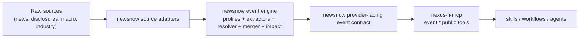

# Investment Event Agent Interface Plan

Status: Active implementation  
Last updated: 2026-04-12  
Scope: define how `newsnow` event outputs should be exposed to agent systems in the broader `nexus-fi` chain

Related operational handoff:

- [investment-event-provider-handoff.md](/Users/huangjiahao/workspace/newsnow/docs/investment-event-provider-handoff.md)
- [investment-event-delivery-board.md](/Users/huangjiahao/workspace/newsnow/docs/investment-event-delivery-board.md)

## 0. Current implementation status

The plan is no longer theoretical. The following pieces are already implemented inside `newsnow`:

- canonical backend investment projection:
  - [`/Users/huangjiahao/workspace/newsnow/server/services/event-engine/investment-view.ts`](/Users/huangjiahao/workspace/newsnow/server/services/event-engine/investment-view.ts)
- explicit provider-facing HTTP routes:
  - [`/Users/huangjiahao/workspace/newsnow/server/api/investment-events/latest.ts`](/Users/huangjiahao/workspace/newsnow/server/api/investment-events/latest.ts)
  - [`/Users/huangjiahao/workspace/newsnow/server/api/investment-events/search.ts`](/Users/huangjiahao/workspace/newsnow/server/api/investment-events/search.ts)
  - [`/Users/huangjiahao/workspace/newsnow/server/api/investment-events/entity.ts`](/Users/huangjiahao/workspace/newsnow/server/api/investment-events/entity.ts)
  - [`/Users/huangjiahao/workspace/newsnow/server/api/investment-events/[id].ts`](/Users/huangjiahao/workspace/newsnow/server/api/investment-events/%5Bid%5D.ts)
  - [`/Users/huangjiahao/workspace/newsnow/server/api/investment-watchlists/[id].ts`](/Users/huangjiahao/workspace/newsnow/server/api/investment-watchlists/%5Bid%5D.ts)
  - [`/Users/huangjiahao/workspace/newsnow/server/api/investment-watchlists/[id]/events.ts`](/Users/huangjiahao/workspace/newsnow/server/api/investment-watchlists/%5Bid%5D/events.ts)
- local provider MCP now consumes those explicit routes directly, and the old public compatibility `projection=investment` event routes have been retired:
  - [`/Users/huangjiahao/workspace/newsnow/server/mcp/server.ts`](/Users/huangjiahao/workspace/newsnow/server/mcp/server.ts)
- local MCP now exposes task-oriented scan/detail tools over that same provider contract:
  - `event_scan`
  - `event_get_detail`
  - `watchlist_scan`

The remaining work is not to invent the provider contract, but to harden it and keep narrowing the gap to the eventual `nexus-fi-mcp` public boundary.

## 1. Purpose

This document defines the correct agent-facing interface strategy for the investment event system.

The key architectural point is:

> `newsnow` is not the final public agent interface.  
> `newsnow` is the event provider.  
> `nexus-fi-mcp` is the public agent abstraction layer.

This distinction matters because the system must not leak event-engine internals to agents or force skills to understand provider-specific semantics.

The goal is to ensure that:

- humans see investment-useful event views
- agents receive structured, auditable, investment-oriented outputs
- `newsnow` remains a strong event provider
- `nexus-fi-mcp` remains the only public MCP boundary for agent workflows

This plan assumes three distinct consumer surfaces:

1. backend event engine  
2. frontend investor experience  
3. agent-facing interface

They must not be treated as the same thing.

## 2. End-to-end chain



## 2.1 Consumer surfaces

### A. Backend event engine

This is the core system.

It is responsible for:

- source normalization
- canonical event generation
- fact extraction
- evidence linking
- event merging
- impact scoring

Success criteria:

- semantic correctness
- determinism where appropriate
- auditability
- replayability
- stable storage and query semantics

### B. Frontend investor surface

This is the human-facing product surface inside `newsnow`.

It is responsible for:

- presenting events in investor language
- prioritizing what matters for decision-making
- hiding engine internals by default
- making facts, evidence, and next checks understandable to a discretionary investor

Success criteria:

- fast scanability
- clear investment meaning
- readable facts and evidence
- minimal leakage of engine/debug terminology

### C. Agent-facing interface

This is the machine-facing surface.

It is responsible for:

- exposing stable structured contracts
- preserving facts and evidence
- making investment interpretation machine-readable
- avoiding provider-specific semantics leaking into skill workflows

Success criteria:

- strong schema stability
- low ambiguity
- evidence-backed conclusions
- low need for downstream prompt-side reconstruction

## 3. Responsibilities by layer

### 3.1 `newsnow`

`newsnow` is responsible for:

- collecting and normalizing upstream sources
- producing canonical events
- extracting structured facts
- linking evidence
- generating investment-oriented interpretation fields
- exposing a stable provider-facing event payload

`newsnow` is not responsible for:

- being the only public MCP boundary for all agents in the NexusFi architecture
- forcing downstream skills to understand raw event-engine internals
- owning final workflow semantics for each agent use case

### 3.2 `nexus-fi-mcp`

`nexus-fi-mcp` is responsible for:

- exposing stable `event.*` public tools
- translating provider outputs into public tool contracts
- attaching unified metadata and guard semantics
- insulating skills from provider changes

`nexus-fi-mcp` is not responsible for:

- re-implementing `newsnow` event extraction logic
- rebuilding facts from raw event text
- becoming an event engine itself

### 3.3 Skills and workflows

Skills should:

- consume public `event.*` tools
- reason over investment-oriented event payloads
- avoid provider-specific branching

Skills should not:

- understand `newsnow` resolver internals
- parse `event_snapshot_changed`, `canonical_identity_merge`, `industry_release`, or similar engine terms
- reconstruct event meaning from raw provider fields

### 3.4 Frontend vs agent boundary

The frontend and the agent interface serve different audiences and must diverge where necessary.

Frontend should optimize for:

- investor readability
- prioritization
- visual comparison
- concise explanations

Agent interfaces should optimize for:

- schema stability
- machine readability
- evidence traceability
- explicit uncertainty and confidence handling

Therefore:

- frontend may collapse or summarize certain fields for readability
- agent output must keep structured facts and evidence explicit
- neither surface should expose engine/debug terms by default

## 4. Current problem

Today `newsnow` already has strong event-engine internals, but the current MCP/tool-facing outputs are still too close to engine/debug views.

Current issues include:

- event outputs are often text-assembled instead of strongly structured
- internal event-engine terms leak into consumer surfaces
- facts, evidence, and investment interpretation are not exposed as a coherent contract
- some enums in [`/Users/huangjiahao/workspace/newsnow/server/mcp/server.ts`](/Users/huangjiahao/workspace/newsnow/server/mcp/server.ts) already lag behind the current event model

This creates two risks:

1. the human UI becomes harder to interpret because it mirrors engine terminology  
2. agents get low-level event data instead of investment-ready objects

## 5. Design principle

The interface strategy must follow this rule:

> `newsnow` should expose a stable provider-facing investment event projection.  
> `nexus-fi-mcp` should expose the final public agent contract.

This means the work should be split into two contracts, not one.

## 6. Contract split

### 6.1 Provider-facing contract in `newsnow`

This is the payload `nexus-fi-mcp` should consume from `newsnow`.

It should contain three layers:

1. investment interpretation  
2. structured facts  
3. evidence trail  

### 6.2 Public agent contract in `nexus-fi-mcp`

This is the payload skills and workflows should consume.

It should preserve the three layers above but normalize naming, filtering, and metadata according to NexusFi public tool standards.

## 7. Target provider contract for `newsnow`

### 7.1 `InvestmentEventBrief`

Used for scans, watchlists, feeds, morning reports, and prioritization.

```ts
type InvestmentEventBrief = {
  eventId: string
  title: string
  eventFamily: EventFamily
  signalDirection: "positive" | "negative" | "neutral" | "mixed" | "unknown"
  signalConfidence: number
  materialityScore: number
  tradabilityScore: number
  authorityScore: number
  affectedMarkets: AffectedMarket[]
  affectedEntities: InvestmentEntityRef[]
  whyItMatters: string
  tradableNow: "yes" | "watch" | "no"
  whatToWatchNext: string[]
  riskOfMisread: string[]
  sourceSummary: {
    primarySourceId: string
    primarySourceName: string
    sourceKinds: string[]
  }
  publishedAt: number
}
```

### 7.2 `InvestmentEventDetail`

Used for deep event review.

```ts
type InvestmentEventDetail = InvestmentEventBrief & {
  thesis: string
  keyFacts: InvestmentEventFact[]
  evidence: InvestmentEventEvidence[]
  timelineSummary: InvestmentTimelineEntry[]
  relatedTopics: string[]
  relatedEvents: RelatedEventRef[]
}
```

### 7.3 `InvestmentEventFact`

Facts must remain first-class and auditable.

```ts
type InvestmentEventFact = {
  factType: string
  label: string
  metricName?: string
  value?: string | number | boolean | null
  previousValue?: string | number | boolean | null
  delta?: string | number | null
  unit?: string | null
  direction?: "up" | "down" | "flat" | "unknown" | null
  effectiveAt?: number | null
  confidence: number
  entity?: InvestmentEntityRef | null
  evidenceId?: string | null
}
```

### 7.4 `InvestmentEventEvidence`

Evidence is required so agents can cite and audit.

```ts
type InvestmentEventEvidence = {
  evidenceId: string
  sourceId: string
  sourceName: string
  authorityLevel: number
  sourceKind: string
  title: string
  summary?: string | null
  url?: string | null
  publishedAt?: number | null
  extractionStatus: "ready" | "degraded" | "legacy" | "failed"
}
```

### 7.5 `InvestmentEntityRef`

Entity references must be human-readable and stable.

```ts
type InvestmentEntityRef = {
  entityId: string
  label: string
  entityType: "security" | "issuer" | "market" | "industry" | "topic" | "institution"
  code?: string | null
  market?: string | null
}
```

## 8. Target public tool contract in `nexus-fi-mcp`

The final public tools should not expose provider internals.

Recommended tools:

- `event.scan`
- `event.get`
- `event.search`
- `event.watchlist_scan`

These tools should return normalized public objects derived from the provider contract above.

Example shape:

```ts
type EventScanResult = {
  items: InvestmentEventBrief[]
  meta: {
    freshnessMs: number
    provider: "newsnow"
    completeness: "high" | "medium" | "low"
  }
}
```

## 9. What must not be exposed by default

The following fields are engine-internal and should not be default public output:

- `event_snapshot_changed`
- `canonical_identity_merge`
- `media_fast_signal`
- `industry_release`
- `parserFamily`
- `resolverVersion`
- raw payload JSON

These may still exist in:

- debug mode
- internal admin interfaces
- replay / shadow / diagnostics

But they should not be the normal language used by human UI or agent-facing contracts.

## 10. Investment language rules

The interface must answer five practical investor questions:

1. what happened  
2. why does it matter  
3. who or what is affected  
4. can it be traded now, or only monitored  
5. what must be confirmed next  

This means the primary interpretation fields should be:

- `whyItMatters`
- `tradableNow`
- `whatToWatchNext`
- `riskOfMisread`

Facts and evidence support those fields, not replace them.

## 11. Mapping examples

### 11.1 Central bank operation

Raw engine view might contain:

- `eventType = policy`
- `eventSubType = monetary_policy`
- fact types like `central_bank_operation`

Provider-facing investment view should look like:

- `eventFamily = rates_liquidity`
- `whyItMatters = "央行逆回购操作直接影响短端资金面和利率预期"`
- `keyFacts = [{ label: "期限", value: "7天" }, { label: "利率", value: 1.4, unit: "%" }, ...]`

### 11.2 Rumor clarification

Raw engine view might contain:

- media source
- neutral directional view
- evidence text

Provider-facing investment view should look like:

- `eventFamily = rumor_clarification`
- `whyItMatters = "公司对订单与交付传闻作出回应，短期作用在于修正市场预期"`
- `tradableNow = "watch"`
- `whatToWatchNext = ["后续订单公告", "交付节奏", "上游供给约束"]`

### 11.3 Industry news

Raw engine view might contain:

- `industry_news`
- topic tags
- industry evidence

Provider-facing investment view should look like:

- `eventFamily = industry_news`
- `whyItMatters = "更适合作为主题催化线索，需等待销量、产量、订单等硬数据确认"`
- `tradableNow = "watch"`

## 12. Changes required in `newsnow`

### 12.1 Add an explicit provider projection layer

Recommended module:

- [`/Users/huangjiahao/workspace/newsnow/server/services/event-engine/investment-view.ts`](/Users/huangjiahao/workspace/newsnow/server/services/event-engine/investment-view.ts)

Responsibilities:

- convert `EventRecord` and `EventDetail` into `InvestmentEventBrief` / `InvestmentEventDetail`
- map internal fact types to investment-language labels
- remove engine-only fields from default output
- normalize affected entities and source summaries

### 12.2 Keep raw engine detail available behind debug mode

Do not delete diagnostics.  
Move them behind explicit `debug=true` or internal-only endpoints.

### 12.3 Mark current `server/mcp/server.ts` as legacy provider MCP

`newsnow`'s own MCP server may remain useful for local debugging, but it should no longer be treated as the canonical public agent contract.

## 13. Changes required in `nexus-fi-mcp`

`nexus-fi-mcp` should:

- consume `newsnow` provider-facing projections
- expose stable `event.*` tools
- add unified metadata envelope and guard semantics
- keep provider switching transparent to skills

It should not:

- rebuild event meaning from raw `newsnow` text summaries
- parse event-engine internals on behalf of skills

## 14. Migration sequence

### Phase A

In `newsnow`:

- define shared investment event projection types
- add `investment-view.ts`
- add provider-level projection tests

### Phase B

In `newsnow`:

- expose projection through event detail/list helpers
- keep debug/engine fields behind explicit debug mode

### Phase C

In `nexus-fi-mcp`:

- move `event.*` tools to the new projection
- stop relying on provider-specific text formatting

### Phase D

In skills and workflows:

- consume only public normalized `event.*` outputs
- stop parsing provider internals

## 15. Decision

The correct optimization target is not "make `newsnow` MCP text prettier".

The correct target is:

1. `newsnow` becomes a high-quality investment event provider  
2. `nexus-fi-mcp` becomes the only stable public agent boundary  
3. skills consume structured investment event objects, not engine internals

This preserves architectural boundaries and produces outputs that are genuinely useful for investment workflows.
