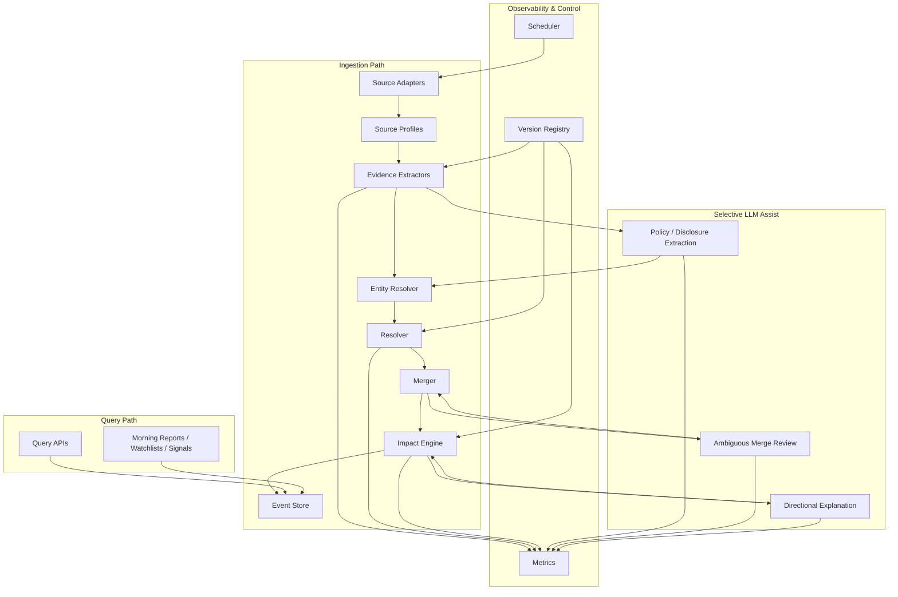

# Investment Event Engine Upgrade Plan

Status: Draft v2  
Last updated: 2026-04-11  
Scope: `newsnow` event system upgrade from rule-based event bus to investment-grade event engine

See also: [investment-event-agent-interface-plan.md](./investment-event-agent-interface-plan.md)
See also: [investment-event-workstreams.md](./investment-event-workstreams.md)

## 1. Purpose

This document defines the system-wide upgrade plan for turning the current event layer into a professional investment event engine.

The goal is not to build "another news list". The goal is to build a durable event infrastructure that can support:

- macro monitoring
- market and industry tracking
- announcement and disclosure tracking
- watchlists
- morning reports
- strategy and signal systems

The upgraded system serves three separate but connected layers:

1. backend event engine as the core decision infrastructure  
2. frontend investor surface for human discretionary use  
3. agent-facing interface for machine workflows

These layers share the same event truth, but they do not share the same presentation contract.

This document is written so that any programming model or engineer can continue the work without drifting away from the intended architecture.

## 2. Current state

Today the repository has two related but different systems:

1. `news` layer
   - pulls source data
   - normalizes it into `NewsItem[]`
   - serves it through `/api/s`
   - is already useful for real-time reading and source-level monitoring

2. `event-bus` layer
   - ingests selected sources
   - stores raw items
   - classifies them into coarse event types
   - clusters similar items into events
   - exposes them through `/api/events/*`

Current key files:

- [shared/pre-sources.ts](../shared/pre-sources.ts)
- [shared/types.ts](../shared/types.ts)
- [server/services/event-bus.ts](../server/services/event-bus.ts)
- [server/database/events.ts](../server/database/events.ts)
- [server/types.ts](../server/types.ts)
- [server/api/events/latest.ts](../server/api/events/latest.ts)
- [server/api/events/search.ts](../server/api/events/search.ts)
- [server/api/events/[id].ts](../server/api/events/%5Bid%5D.ts)

### 2.1 Current strengths

- source onboarding is fast
- the `news` pipeline is stable and already valuable
- the event layer already has ingestion, storage, clustering, and query endpoints
- finance and industry sources are already flowing into the event layer

### 2.2 Current limitations

- `eventType` is mainly inferred from source id prefixes
- `eventSubType` is mainly inferred from title and summary keywords
- `NewsItem` is display-oriented rather than fact-oriented
- high-value upstream structured fields are often collapsed away before event processing
- event merging is too dependent on normalized titles
- importance is coarse and not yet investment-grade
- there is no explicit market impact model
- there is no event lifecycle model
- read and write paths are coupled because latest-event queries may trigger ingestion
- `market_move` and `sentiment` exist in types, but are not meaningfully populated by the current pipeline
- structured macro and disclosure facts are not first-class data

The current implementation is a valid bootstrap system, but not yet a professional investment event engine.

## 3. Design principles

The target system must obey the following principles.

### 3.1 Event semantics must be declarative

Source meaning must not be guessed from prefixes as the primary mechanism.

Each source must explicitly declare:

- what kind of source it is
- what markets it affects
- what event family it belongs to
- how authoritative it is
- which extractor family should parse it

### 3.2 Facts must be first-class

The system must store structured facts, not only text.

Examples:

- `OMO`: operation type, tenor, rate, bid amount, volume, net injection
- `FDR007`: fixing value, change in bp, effective date
- `LPR`: tenor, current value, previous value, delta
- `earnings`: period, revenue, profit, guidance, YoY
- `listing halt`: halt reason, halt time, resume status

### 3.3 Deterministic logic must dominate when the source is authoritative

For official and highly structured sources, the system must prefer:

1. source profile
2. structured extractor output
3. deterministic resolver rules

LLM should only assist when the case is ambiguous or text-heavy.

### 3.4 Event outputs must be investment-oriented

Every event should be useful for decision workflows, not only archive workflows.

The engine should produce:

- event type and subtype
- linked markets and entities
- materiality
- directional view
- directional confidence
- tradability
- evidence trail

### 3.5 Read and write paths must be separated

Query traffic must not be responsible for triggering ingestion side effects.

The upgraded architecture must ensure:

- ingestion is run by explicit worker or scheduler paths
- query APIs read already-materialized event state
- freshness policy is observable and configurable
- report generation does not hide implicit writes

### 3.6 Operational observability is a first-class concern

The system must be observable from Phase 1 onward.

At minimum, the engine must report:

- ingestion latency
- extractor success and failure counts
- merge conflict rates
- event creation and update counts
- LLM usage counts and latency
- directional-view coverage

### 3.7 Every model must be able to continue safely

The upgrade must be modular, explicit, and testable. No phase should rely on undocumented tribal knowledge.

## 4. Target architecture



### 4.1 Target modules

Recommended module boundaries:

- `shared/event-profile.ts`
  - shared types and enums for event semantics
- `server/services/event-engine/profiles.ts`
  - profile lookup and validation
- `server/services/event-engine/extractors/`
  - extractor families by source kind
- `server/services/event-engine/entity.ts`
  - entity normalization and lookup
- `server/services/event-engine/resolver.ts`
  - event classification and routing
- `server/services/event-engine/merger.ts`
  - event merge policy
- `server/services/event-engine/impact.ts`
  - materiality, directional view, tradability
- `server/services/event-engine/query.ts`
  - read-side event queries
- `server/services/event-engine/scheduler.ts`
  - ingestion scheduling and freshness control
- `server/services/event-engine/metrics.ts`
  - metrics collection and reporting
- `server/services/event-engine/versions.ts`
  - extractor, resolver, impact, and prompt versioning
- `server/services/event-engine/llm/`
  - carefully bounded LLM-assisted tasks

The existing [server/services/event-bus.ts](../server/services/event-bus.ts) can be migrated into these modules incrementally, but the target architecture should be based on these responsibilities.

### 4.2 Read and write path separation

The target architecture must explicitly separate:

- ingestion path
  - fetch source data
  - extract evidence
  - resolve and merge events
  - write event state

- query path
  - read already persisted event state
  - filter, sort, and project
  - never fetch upstream sources directly

This means `/api/events/*` must become read-only from a data mutation perspective.

### 4.3 Source adapter contract and passthrough strategy

The current `SourceGetter -> NewsItem[]` contract is good for the `news` layer but too weak for a professional event engine.

The target contract is:

- keep `NewsItem[]` compatibility for the `news` layer
- preserve upstream structured metadata for event ingestion
- avoid forcing extractors to reconstruct facts from lossy display text

Phase 1 policy:

1. investment-critical source families must preserve parseable upstream metadata in persisted ingestion payloads
2. extractors must prefer preserved upstream metadata over reparsing titles
3. extractors may re-request upstream data only if:
   - no stable passthrough payload exists
   - the source is authoritative enough to justify the cost
   - the latency budget allows it
4. new source onboarding for investment-critical families must declare which raw fields are preserved for event ingestion

This avoids moving the current semantic loss problem from the event layer into extractor code.

## 5. Scope of the structured event engine

The structured event engine should include all sources that have direct investment value and reliable provenance.

This includes:

- policy and regulatory sources
  - `pbc-*`
  - `csrc-*`
  - `safe-*`
  - `mof-*`
  - `mofcom-*`
  - `ndrc-*`
  - `miit-*`
  - `nhsa-*`
  - `nea-*`
- market benchmark and macro data sources
  - `chinamoney-*`
  - `stats-*`
- exchange and disclosure sources
  - `cninfo-*`
  - `sse-*`
  - `hkexnews-*`
- industry data and industry policy sources
  - `chinaisa-*`
  - `chinania-*`
  - `chinapv-*`
  - `caam-*`
  - `caict-*`
  - `semi-*`
- high-quality media fast feeds
  - `cls-*`
  - `wallstreetcn-*`
  - `jin10`
  - `gelonghui`
  - `fastbull-*`
  - `mktnews-*`

Important distinction:

- authoritative and structured sources should be allowed to create canonical events
- media sources should usually act as evidence, context, and acceleration layers

## 6. Data model target

The database must be upgraded through a proper migration. The current event tables are not rich enough for the target engine.

### 6.1 Core tables

1. `event_sources`
   - source semantic profile snapshot

2. `event_evidences`
   - every raw evidence item

3. `event_facts`
   - structured facts extracted from evidence

4. `events`
   - event aggregate and state

5. `event_links`
   - links to entities, topics, markets, industries

6. `event_timeline`
   - event lifecycle state changes and revisions

### 6.2 Proposed event fields

The upgraded `events` table should include at least:

- `event_id`
- `event_type`
- `event_subtype`
- `source_kind`
- `canonical_title`
- `canonical_summary`
- `primary_entity_id`
- `primary_entity_name`
- `status`
- `first_seen_at`
- `last_seen_at`
- `published_at`
- `importance`
- `materiality_score`
- `directional_view`
- `directional_confidence`
- `tradability_score`
- `authority_score`
- `freshness_score`
- `surprise_score`
- `affected_markets_json`
- `topic_tags_json`

### 6.3 Proposed evidence fields

The `event_evidences` table should include at least:

- `evidence_id`
- `event_id`
- `source_id`
- `raw_id`
- `source_item_id`
- `title`
- `summary`
- `canonical_url`
- `published_at`
- `fetched_at`
- `source_priority`
- `authority_level`
- `parser_family`
- `passthrough_payload_json`
- `extraction_status`
- `extraction_error`

### 6.4 Proposed fact fields

The `event_facts` table should include:

- `fact_id`
- `event_id`
- `evidence_id`
- `fact_type`
- `metric_name`
- `value`
- `unit`
- `previous_value`
- `delta`
- `direction`
- `effective_at`
- `entity_id`
- `confidence`
- `payload_json`

### 6.5 Proposed link fields

The `event_links` table should include at least:

- `link_id`
- `event_id`
- `link_type`
- `entity_type`
- `entity_id`
- `entity_name`
- `market`
- `industry_tag`
- `topic_tag`
- `role`
- `confidence`
- `resolver`
- `metadata_json`

Design rule:

- one row represents one normalized query relation
- hot query dimensions should be represented explicitly in columns instead of only inside JSON
- the table should support filtering by entity, market, industry, and topic without JSON substring scans

### 6.6 Proposed timeline fields

The `event_timeline` table should include at least:

- `timeline_id`
- `event_id`
- `state_from`
- `state_to`
- `changed_at`
- `trigger_evidence_id`
- `actor`
- `reason`
- `metadata_json`

### 6.7 Queryability and index strategy

JSON columns may still exist, but they must not be the primary mechanism for queryable dimensions.

Rules:

- indexed scalar columns should be used for hot filters and hot sorts
- `event_links` should carry queryable relations for:
  - entities
  - markets
  - industries
  - topics
- JSON fields should be treated as:
  - archival payloads
  - display payloads
  - sparse extension containers

This means the engine should not depend on `LIKE '%topic%'` as its main retrieval strategy.

### 6.8 Score semantics

All scoring fields must use a unified and explicit scale.

Recommended standard:

- store scores as integers in the range `0-100`
- `0` means no confidence or no significance
- `100` means maximum confidence or significance under the current model

Semantics:

- `materiality_score`
  - estimated real-world and market significance of the event itself
- `directional_confidence`
  - confidence in the current directional view, not confidence that the event happened
- `tradability_score`
  - expected usefulness for a tradeable decision horizon
- `authority_score`
  - reliability of the source and evidence chain
- `freshness_score`
  - time sensitivity and decay-adjusted freshness
- `surprise_score`
  - deviation from expected baseline or prior state

### 6.9 Database migration strategy

The migration must be explicit and reversible.

Recommended strategy:

1. create the upgraded tables in parallel
2. keep current raw evidence persistence available
3. dual-write new ingestion outputs into the upgraded schema during validation
4. run shadow comparisons between old and new event outputs
5. switch `/api/events/*` to the new read path once parity gates are met
6. freeze the old event schema as read-only compatibility storage
7. retire the old schema in Phase 4 after backfill and stability validation

This is a migration strategy, not a long-term dual-architecture commitment.

## 7. Source profile model

### 7.1 New shared types

Add a new `eventProfile` field to source definitions.

Suggested shape:

```ts
interface EventProfile {
  sourceKind:
    | "official_policy_notice"
    | "official_macro_release"
    | "official_rate_fixing"
    | "official_central_bank_operation"
    | "exchange_disclosure"
    | "industry_stat_release"
    | "industry_policy_notice"
    | "media_fast_feed"
    | "media_analysis"
  defaultEventType:
    | "policy"
    | "macro"
    | "announcement"
    | "industry"
    | "market_move"
    | "news"
  defaultEventSubType?: string
  authorityLevel: "official" | "exchange" | "association" | "media"
  parserFamily:
    | "policy"
    | "macro_rate"
    | "macro_release"
    | "central_bank_operation"
    | "exchange_announcement"
    | "industry_stat"
    | "media_fast"
  assetClasses: Array<"equity" | "rates" | "fx" | "commodity" | "credit" | "fund">
  markets: Array<"A" | "HK" | "CN_rates" | "CN_macro" | "global_macro">
}
```

### 7.2 Semantic meaning of `sourceKind` vs `parserFamily`

These two fields are intentionally different:

- `sourceKind`
  - semantic classification
  - drives routing, authority, weighting, and event defaults
- `parserFamily`
  - technical classification
  - decides which extractor implementation family is used

Example:

- a source may have:
  - `sourceKind = "official_central_bank_operation"`
  - `parserFamily = "central_bank_operation"`

That means:

- semantically it belongs to central-bank operations
- technically it uses the central-bank-operation extractor code path

### 7.3 Mapping constraints

`sourceKind` and `defaultEventType` must be validated together.

Recommended examples:

- `official_rate_fixing` -> allowed event types: `macro`
- `official_central_bank_operation` -> allowed event types: `policy`, `macro`
- `exchange_disclosure` -> allowed event types: `announcement`
- `industry_stat_release` -> allowed event types: `industry`, `macro`
- `media_fast_feed` -> allowed event types: `news`, `market_move`

New source onboarding for investment-relevant sources must include `eventProfile`. New prefix-only classification rules should not be added except as emergency temporary compatibility patches.

## 8. LLM strategy

LLM is necessary, but it must be used with strong boundaries.

### 8.1 Where LLM should not be primary

LLM should not be the primary mechanism for:

- classifying clearly structured official sources
- parsing numeric facts from stable JSON or stable HTML structures
- basic source family routing
- deterministic event type assignment for official sources
- direct buy or sell decisions

### 8.2 Where LLM has clear value

LLM should be used in these high-value cases:

1. long, dense policy text understanding
   - extract policy subjects, timing, constraints, beneficiaries, losers

2. long disclosure text understanding
   - summarize complex announcements and identify core impact dimensions

3. ambiguous event merge resolution
   - decide whether two candidate evidence clusters describe the same investment event

4. directional interpretation support
   - generate reasoned directional hypotheses grounded in structured facts

5. report composition
   - compile morning report sections with clearer structure and explanation

### 8.3 LLM usage policy

All LLM-assisted steps must satisfy:

- rule-first and fact-grounded
- explicit JSON schema outputs
- confidence score output
- rationale output
- input evidence references
- deterministic fallback when LLM is unavailable
- audit logging of prompt version and output

### 8.4 Example LLM call boundary

Good use:

- input:
  - policy text
  - extracted entities
  - source profile
  - known structured facts
- output:
  - structured policy facts
  - affected industries
  - directional hypothesis
  - confidence and rationale

Bad use:

- input:
  - plain title only
- output:
  - guessed event type
  - guessed numbers
  - guessed trading advice

### 8.5 Latency budget and async enhancement policy

The event engine must preserve timeliness for market-critical events.

Policy:

- deterministic event publication must not wait for LLM on critical official-source paths
- LLM enrichment should usually run asynchronously after the deterministic event is published
- query APIs must expose whether an event has:
  - deterministic core fields only
  - or deterministic core fields plus LLM enrichment

Recommended latency targets:

- market-critical deterministic path
  - additional p95 budget from enrichment layer: `0 ms`
- synchronous LLM path
  - reserved only for non-critical report generation and bounded analyst workflows
- asynchronous enrichment path
  - target completion within `5-30 seconds` depending on task type

This means `OMO`, `MLF`, `Shibor`, `FDR007`, `LPR`, and exchange halts should publish deterministic core events first, then enrich later if needed.

## 9. Operational requirements

### 9.1 Observability

The engine must emit metrics from Phase 1.

Required metrics:

- source ingestion latency
- evidence creation count
- extractor success count
- extractor failure count
- extractor fallback count
- event create count
- event update count
- merge collision rate
- unresolved entity rate
- directional-view coverage
- LLM invocation count
- LLM success and fallback count
- LLM latency

### 9.2 Concurrency and idempotency

The system must remain safe under repeated or parallel ingestion.

Required properties:

- idempotent raw evidence upsert
- idempotent event merge writes
- deterministic merge keys where possible
- explicit version tagging when resolver or extractor logic changes

### 9.3 Versioning

Versioning must apply to more than prompts.

The system should version:

- extractor family versions
- resolver ruleset versions
- impact model versions
- prompt schema versions

This is required so that:

- historical event outputs can be audited
- backfills can be compared
- score changes can be traced to rule changes

### 9.4 Testing strategy

Phase 1 must adopt fixture-based replay tests.

Required testing layers:

- fixture replay tests for authoritative source families
- resolver unit tests
- merger behavior tests
- impact scoring tests
- API integration tests

Fixture policy:

- fixtures must preserve representative upstream payloads
- fixtures must be versioned
- replay tests must verify:
  - event type
  - event subtype
  - facts
  - entity links
  - merge behavior
  - directional outputs where applicable

### 9.5 Deployment compatibility

The upgraded event engine must explicitly define runtime expectations.

Recommended policy:

- authoritative write path runs on Node or equivalent persistent worker runtime
- serverless and edge deployments may remain query-capable
- if a deployment cannot run the ingestion worker, it must be treated as read-only for event freshness

This avoids silently relying on query traffic to keep event data fresh.

### 9.6 Failure and degradation matrix

The event engine must degrade predictably. Failures should not lead to silent semantic drift.

| Component | Failure mode | Default behavior | Event creation policy | Score and state policy |
| --- | --- | --- | --- | --- |
| Source adapter | upstream fetch failed | record ingestion failure and stop processing this source batch | no new evidence, no event mutation | freshness degrades only through time; authority unchanged |
| Passthrough payload | upstream structured fields missing | continue with available raw text and source profile | evidence may still be created | `authority_score` remains source-derived; cap downstream confidence-oriented scores |
| Extractor | structured fact extraction failed | persist evidence with degraded extraction status | create event only if profile and minimal text routing are sufficient | `directional_confidence`, `materiality_score`, `tradability_score` capped conservatively; event marked degraded |
| Entity resolver | entity service unavailable or unresolved | keep event, store unresolved or partial links | event still allowed | entity-dependent scoring is capped; link confidence lowered |
| Resolver | subtype remains ambiguous | fall back to profile default and explicit `unknown/other` subtype | event allowed | confidence lowered; no aggressive directional output |
| Merger | cannot confidently decide merge | prefer conservative non-merge over speculative merge | create separate candidate event | mark merge confidence low; allow later reconciliation |
| Impact engine | impact model failed | persist event without directional enrichment | event allowed | `directional_view = unknown`; confidence and tradability left null or low |
| LLM assist | timeout, schema failure, unavailable | skip LLM and keep deterministic output | event allowed | no LLM-derived fields; deterministic state remains canonical |
| Scheduler | ingestion scheduler unavailable | query path remains read-only | no catch-up on query path | freshness visibility must show stale state explicitly |

Rule:

- `authority_score` reflects source and evidence provenance, not extractor success
- extraction or enrichment failures should lower confidence-oriented scores, not rewrite source authority

## 10. Upgrade phases

The upgrade will be delivered in four explicit phases. The architecture is designed from the final target backwards, but execution will be phased.

### 10.1 Timeline assumptions

The estimates below assume:

- start date: 2026-04-13
- one primary implementation lane
- one engineer or one coding model lead, with review support
- no large redesign of the `news` source adapter layer during the same period

Under these assumptions, the target completion date is **2026-06-19**.

### 10.2 Phase overview

| Phase | Dates | Goal | Exit criteria |
| --- | --- | --- | --- |
| Phase 1 | 2026-04-13 to 2026-05-01 | Build the permanent event semantics foundation | declarative source profiles, migrated schema, deterministic resolver v2, first structured official extractors, read/write separation |
| Phase 2 | 2026-05-04 to 2026-05-15 | Expand to disclosure and industry domains | structured extractors for announcement and industry families, improved merger, richer entity linking |
| Phase 3 | 2026-05-18 to 2026-05-29 | Introduce bounded LLM assistance | LLM-assisted policy and disclosure extraction, ambiguous merge review, directional explanation pipeline |
| Phase 4 | 2026-06-01 to 2026-06-19 | Productize and harden | backfill, quality metrics, shadow comparison, API stability, report and watchlist adoption |

## 11. Phase 1: permanent foundation

Phase 1 is not a throwaway transition. It is the first durable slice of the final architecture.

### 11.1 Phase 1 objective

Replace prefix-first event classification with declarative semantics and structured evidence for the highest-value official macro and disclosure sources.

### 11.2 Phase 1 waves

To reduce delivery risk without changing the overall phase model, Phase 1 is split into two delivery waves.

- Phase 1a
  - `2026-04-13` to `2026-04-22`
  - schema, migration, profiles, resolver and merger foundation
- Phase 1b
  - `2026-04-23` to `2026-05-01`
  - structured extractors, directional view v1, query API expansion, fixtures and metrics

#### Phase 1a exit criteria

Phase 1a is complete only when all of the following are true:

1. upgraded schema migration runs successfully on both clean and existing databases
2. `eventProfile` types, validation, and mapping constraints are available for all Phase 1 source families
3. query and ingestion code paths are separated at the module boundary level
4. resolver and merger v2 skeletons compile and pass smoke tests on preserved passthrough payloads
5. migration cutover and rollback notes are written alongside the implementation

#### Phase 1b exit criteria

Phase 1b is complete only when all of the following are true:

1. Phase 1 extractors emit structured facts for all in-scope families
2. directional view v1 is emitted for eligible in-scope event families
3. replay fixtures and metrics are active for the in-scope families
4. `/api/events/*` reads upgraded event state without ingestion side effects

### 11.3 In scope

- introduce `eventProfile`
- migrate database schema
- introduce `event_facts`
- split event engine responsibilities into profiles, extractors, entity, resolver, merger, impact, query, and scheduler
- implement first extractor families
- implement directional view v1
- upgrade event APIs to expose new fields
- establish observability and fixture testing foundation

### 11.4 Source families in scope

Priority sources for Phase 1:

- `pbc-*`
- `chinamoney-*`
- `cninfo-*`
- `sse-*`
- `hkexnews-*`

These families cover:

- central bank operations
- money market benchmarks
- exchange disclosures
- high-value announcement events

### 11.5 Deliverables

#### A. Shared schema

Update:

- [shared/types.ts](../shared/types.ts)
- [shared/pre-sources.ts](../shared/pre-sources.ts)

Deliver:

- `eventProfile` in source definitions
- richer `EventType` and `EventSubType`
- new types for `EventFact`, `EventEvidenceCandidate`, `DirectionalView`, `AffectedMarket`

#### B. Database migration

Update:

- [server/database/events.ts](../server/database/events.ts)
- [server/types.ts](../server/types.ts)

Deliver:

- migration for new event tables and columns
- retained compatibility for raw evidence history
- indexes for `event_type`, `event_subtype`, `primary_entity`, `published_at`, and hot link dimensions
- explicit cutover and rollback notes

#### C. Extractor foundation

Create:

- `server/services/event-engine/extractors/macro-rate.ts`
- `server/services/event-engine/extractors/central-bank-operation.ts`
- `server/services/event-engine/extractors/exchange-announcement.ts`

Deliver:

- structured facts for:
  - `Shibor`
  - `FDR007`
  - `FR007`
  - `LPR`
  - `OMO`
  - `MLF`
  - listing halt and resume
  - earnings
  - financing
  - buyback
  - dividend

#### D. Entity resolution foundation

Create:

- `server/services/event-engine/entity.ts`

Deliver:

- entity normalization rules
- exchange code normalization
- company and industry link hooks
- deterministic fallback behavior when external entity services are unavailable

#### E. Resolver and merger v2

Create:

- `server/services/event-engine/resolver.ts`
- `server/services/event-engine/merger.ts`

Deliver:

- profile-first classification
- fact-aware merge keys
- deterministic entity-link integration
- reduced title-only dependence

#### F. Impact engine v1

Create:

- `server/services/event-engine/impact.ts`

Deliver:

- `directional_view`
- `directional_confidence`
- `materiality_score`
- `tradability_score`

The first version should be rules-based and fact-driven.

#### G. Read and query split

Create:

- `server/services/event-engine/query.ts`
- `server/services/event-engine/scheduler.ts`

Deliver:

- query APIs read event state without side effects
- ingestion is owned by explicit scheduling paths

#### H. Observability and tests

Create:

- fixture replay suite
- event metrics collection

Deliver:

- Phase 1 metrics
- replay fixtures for in-scope source families
- API integration checks for new event fields

### 11.6 Directional view policy in Phase 1

Phase 1 must include directional view, but the output must be disciplined.

Directional view output should be:

- asset-class aware
- evidence-backed
- confidence-scored
- conservative when evidence is weak

Examples:

- `OMO net injection above recent norm` -> easing bias for CN rates, supportive for liquidity-sensitive assets
- `FDR007 sharply higher` -> tighter funding conditions, negative for short-duration liquidity sentiment
- `LPR unchanged despite easing expectation` -> neutral to mildly hawkish surprise depending on prior consensus
- `exchange halt announcement` -> no generic direction; focus on company-level tradability and status change

### 11.7 Completion criteria for Phase 1

Phase 1 is complete only when all of the following are true:

1. `eventType` for in-scope families is no longer primarily determined by source prefix
2. `eventProfile` exists for all in-scope families
3. `pbc-*` and `chinamoney-*` produce structured facts
4. `cninfo-*`, `sse-*`, and `hkexnews-*` high-value announcement classes produce structured facts
5. event APIs expose new event fields
6. `/api/events/*` no longer triggers ingestion side effects
7. the morning report can consume the new event fields
8. replay fixtures cover at least the in-scope source families
9. Phase 1 metrics are emitting and reviewable

## 12. Phase 2: disclosure and industry expansion

### 12.1 Objective

Expand the same event-engine model to industry and broader disclosure domains.

### 12.2 Scope

- extend extractors to:
  - `chinaisa-*`
  - `chinania-*`
  - `chinapv-*`
  - `caam-*`
  - `caict-*`
  - `semi-*`
- add more disclosure extractors for:
  - shareholding changes
  - management changes
  - contracts
  - regulation
- improve entity normalization for industries and listed companies

### 12.3 Completion criteria

- industry events produce structured facts
- event merger recognizes repeated monthly and periodic releases correctly
- watchlists can query by industry tag and market impact

## 13. Phase 3: bounded LLM augmentation

### 13.1 Objective

Add LLM only where it materially improves quality over rules and extractors.

### 13.2 Scope

- policy and long-text disclosure extraction
- ambiguous merge resolution
- directional explanation generation
- report synthesis support

### 13.3 Guardrails

- all LLM outputs must be schema constrained
- all LLM outputs must include confidence
- all LLM outputs must cite source evidence ids
- all LLM outputs must have deterministic fallback
- all LLM outputs must respect sync versus async latency policy

### 13.4 Completion criteria

- measured precision improvement on policy and disclosure extraction
- reduced false merges on sampled ambiguous clusters
- no LLM dependency for deterministic official-source routing

## 14. Phase 4: production hardening

### 14.1 Objective

Make the event engine reliable enough to be the backbone for downstream investment workflows.

### 14.2 Scope

- backfill and replay historical data
- shadow comparison between old and new event outputs
- quality metrics and alerting
- ingestion health monitoring
- latency and storage tuning
- downstream adoption in reports, watchlists, and skill tools

### 14.3 Backfill boundary policy

Backfill must be explicit and bounded.

Initial Phase 4 policy:

- target backfill window: the most recent `12 months` of retained `raw_items`, or full retained history if less than `12 months`
- backfill uses the latest approved extractor, resolver, and impact versions, and stores those versions with the generated outputs
- backfill writes only into the upgraded schema and does not mutate legacy event rows in place
- if backfilled evidence collides with already materialized upgraded events, the current versioned merger rules must reconcile them using normal evidence-append semantics

This keeps historical replay useful without making the old schema a second active system.

### 14.4 Completion criteria

- stable daily event volume and latency
- monitored extraction error rates
- monitored merge conflict rates
- monitored LLM enrichment latency and fallback rates
- morning report and watchlist use the upgraded event schema by default

## 15. What must not happen

The following are explicit anti-patterns:

- adding more prefix-based special cases as the main long-term strategy
- making LLM the default classifier for official sources
- storing only text and postponing facts indefinitely
- generating directional views with no explicit evidence
- conflating media commentary with canonical official events
- relying on query traffic to keep event data fresh

## 16. Implementation invariants

These invariants must hold across all phases:

1. `news` remains usable and independently valuable
2. event engine changes must be testable with replayable fixtures
3. structured facts always win over text heuristics
4. LLM is assistive, not authoritative, for deterministic data families
5. no phase may require undocumented manual interpretation
6. ingestion and query paths remain explicitly separated

## 17. Immediate next step

Start Phase 1.

The first implementation PR series should focus on:

1. source profile types and schema
2. database migration
3. `pbc-*` and `chinamoney-*` extractors
4. event resolver v2
5. entity resolution foundation
6. impact engine v1
7. query and scheduler split
8. event API field expansion
9. fixture replay harness and metrics

That is the minimum slice that turns the current system from a prefix-based event bus into the first durable version of an investment event engine.
